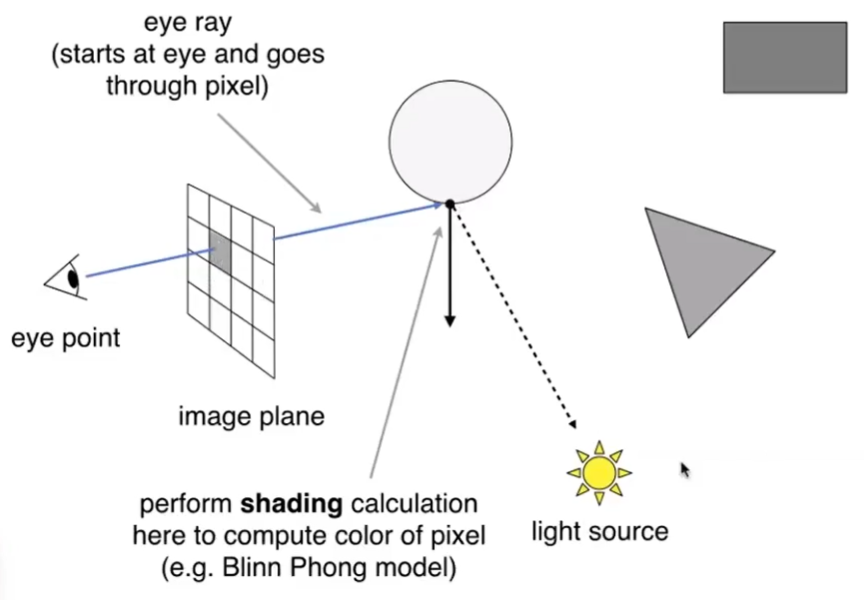

# Ray Casting 算法[20：40]

Ray Casting目标是找到从眼睛到光源之间的光路。  

## 假设

1. 光源是点光源。
2. camera 是一个点
3. 完美折射（不考虑反射）
4. 只弹射一次

## 具体步骤

  

1. 从眼睛向每个像素投出一根视线(eye ray)
2. 光线和场景相交，求最近的交点
3. 交点与光源连线，判断定是否在阴影中 
4. 算着色 
5. 写回像素值

------------------------------

> 本文出自CaterpillarStudyGroup，转载请注明出处。  
> https://caterpillarstudygroup.github.io/GAMES101_mdbook/