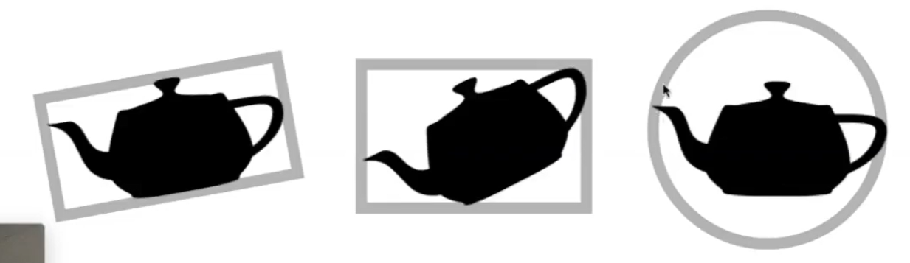

# 光线与显式曲面求交

最常见的显式曲面是Mesh。

## 基本方法

依次判断与曲面上的每个三角形求交。

速度非常慢！！！

因此需要使用一些方法来加速。

## Bounding Volumes 包围盒 

一种可以把物体包围起来的简单几何形状。可用于简体计算。

  

先判断光线与BV是否相交，然后再求与物体的相交情况。

最常见的BV是长方体。长方体可以看作是3个不同的对面（slab）形成的交集。

  

因此又被称为AABB。AABB = Axis Aligned Bounding Box。

### 光线与AABB是否相交

以二维情况为例，长方形为2个不同的对面（slab）形成的交集。 

1. 求光线与x轴方向上的两个对面相交的时间，tmin和tmax

  

2. 求光线与y轴方向上的两个对面相交的时间，tmin和tmax

  

3. 光线进入 AABB 的时间为所有[tmin, tmax] 的交集

  

4. 分析光线与AABB的相交情况

tenter = max{tmin}, texit = min{tmax}  

tenter < texit && texit > 0⇒ 光线与AABB 相交

texit < 0 || tenter > texit ⇒ 不相交

tenter < 0 < texit ⇒ 光源在 AABB 内

> &#x2757; 以上方法对三维同样适用。计算每对平面的tmin和tmax，然后求交集。  
> &#x1F4A1; 对于凸多边形（体），判断点是否在内部，常规方法是依次判断点是否在边（面）的同一侧。但AABB的特点在于两条边（面）是平行的，因此可以一次判断点跟两条边（面）的关系。  

### 求光线与slab相交的时间

Q:为什么要用 AABB？
A:光线与Axis Aligned平面求交的计算简单

|普通平面|AA平面|
|---|---|
|||
|\\(t = \frac{(p'- o) \dot N}{d \dot N}\\)|\\(t = \frac{(p'_x- o_x) }{d_x}\\)|

## 利用 AABB 加速 场景中的光线与所有物体求交的过程

### 均匀的格子 Uniform Grids  

> &#x2705; **算法前提：光线与 Grid 求交很快，与 object 求交很慢**
> &#x1F4A1; 对于复杂操作，先进行快而粗的处理，再进行慢而精的处理，是常见做法。也可以是两者同时进行，前者相当于剪枝。  

所设有以下的场景：

1. 找到场景的 Bounding Volumn  

> &#x1F4CC;上图中的黑色边框就是BV

2. BV划分成格子

3. 判断每个 Grid 是否有物体，即判断格子和物体表面是否相交

4. 判断光线与 Grid 是否相交，

5. 如果Grid内有 object且光线与Grid相交，再计算光线与 grid 内的 object 是否相交

算法特点：
1. grid 不能太疏或密
2. 适用于 object 的大小接近且位置均匀
3. 不适用于 object 分布不均匀的场景

> &#x2753; 什么是位置均匀的？我的理解是稀疏，也就是通过AABB排除的部分越多越好。  

### 空间划分 Spatial Partition

- Octree：八叉树，仅在必要的时候继续切，每次切成同样大小的八块。高维度时每一次都要划分出很多块，出现维度灾难。  
- KD tree：与八叉树的区别是，每次只选择沿着一个轴方向进行切分，且不一定从中间切
- BSP tree：与KD tree的区别是，不一定沿着轴方向切。因此在计算光线与平面的交点时没那么方便，且维度越高越难计算。  

视频以KD Tree 为例子。

#### 构造KD Tree

- 中间结点

划分轴：x,y,z轴轮流  
划分点：根据特定的策略选择  
child: 2个  
object: 不存 object 数据

- 叶子结色  
 存 list of objects.

#### Traverse.

递归进行。  
如果光线与某个中间结点相交，则继续判断中间结果的子结点，否则跳过。  
如果光线与某个叶子结果相交，则继续与叶子中存储的所有objects计算，否则跳过。

#### 局限性

1. 如何判断AABB包围盒与objects中的三角形相交。
2. object 可能存在于多个叶子结点中

> &#x2705; 基于空间划分，obj会重复。基于obj划分，空间会重复。  

### 物体划分 Object Partition

BVH：Bounding Volumn Hierarchy  

优点：解决以上2个问题  
局限性： BV 有重叠，好的划分使重叠尽量少

#### Create

1. 计算 B V
   
> &#x2705; 对所有objects求包围盒的过程非常简单，解决了“判断AABB包围盒与objects中的三角形相交”的问题。

2. 对BV内的**object**划分

> &#x2705; 对object进行划分，解决了“object 可能存在于多个叶子结点中”的问题。  
> &#x2705; 已知BV，挑出在BV内的obj;已知obj，画出obj外的BV。  

以上两步交替进行

|划分|生成树|
|---|---|
|||
|||
|||

但BVH引入了空间的相交。如何划分是效率的关键，好的划分应该让空间的相交尽量地少。  
通常选择对最长的轴进行划分，取中间的object作为划分点。当BV中的三角形个数少于门限时停止。  

> &#x1F50E; 给一堆无序的数，快速选择算法可以在O(n)的时间点找到第i大的数。  

#### 数据结构

- 中间结点：

包围盒、child: 2个  

- 叶子结色  
 存 list of objects.

#### Traverse

同上

### KD Tree VS. BVH  

------------------------------

> 本文出自CaterpillarStudyGroup，转载请注明出处。  
> https://caterpillarstudygroup.github.io/GAMES101_mdbook/