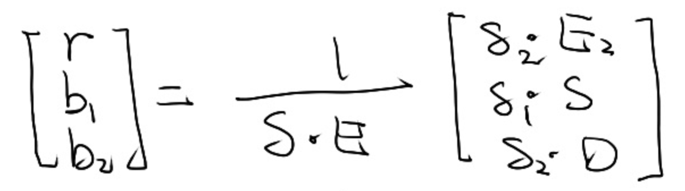

# Ray-Surface 交点

## 定义

光线：(o, t)，即（起点，方向）  
光线上的某一点： o+td, t>=0

## 光线与球的交点

ray: \\(R(t) = o + td\\)  
圆: \\((p - c) ^ 2 - R^2 = 0\\)  
⇒ \\((o + td - c) ^ 2 - R^2 = 0\\)  

解出t，取大于0且较小的t

## 光线与隐式曲面的交点

ray: \\(R(t) = o + td\\)  
曲面： f(p) = 0

⇒ f(o + td)=0
解出t

## 光线与三角形面片的交点

任意一个点与封闭 mesh 求交，
交点个数为奇数则点在内
交点个数为偶数则点在外

### 光线与三角形的交点

1. 光线与三角形面片所在的平面求交点
ray: \\(R(t) = o + td\\)  
平面：\\((p-p') \dot N = 0\\)  
平面公式解释：点乘为0代表垂直，N是平面的法向量，p'为平面上任意一点  

⇒ \\((o + td - p') \dot N = 0\\)  
解得：\\(t = \frac{(p'- o) \dot N}{d \dot N}\\)

2. 判断交点是否在三角形内

或 MT 算法。 (P 37）

点在三角形内 \\(\Leftrightarrow\\) 点用三角形的重心坐标表示且满是 constrain  

0 + t D =（1-b1 - b2)P0 + b1P1 + b2p2

其中大写为3D已知向量，小写为未知标量

解得：

判定结果AC的条件：r>0, b1>0, b2>0, 1-b1-b2>0

### 算法加速

Bounding Volumes 包围盒[56：40]

1.长方体，即3个不同的对面（slab）形成的交集[58:36]

AABB = Axis Aligned Bounding Box

  
求光线与每个轴上的对面相交的时间，tmin和tmax

光线进入 AABB 的时间为所有[tmin, tmax] 的交集

tenter = max{tmin}, texit = min{tmax}  

tenter < texit ⇒ 光线与AABB 相交

texit < 0 ⇒ 不相交

tenter < 0 < texit ⇒ 光源在 AABB 内

Q:为什么要用 AABB
A:光线与朋平面求交的计算简单[1:15:49]

普通平面：\\(t = \frac{(p'- o) \dot N}{d \dot N}\\)

AABB平面：\\(t = \frac{(p'_x- o_x) }{d_x}\\)

### 怎样利用 AABB 加速 ray tracing

#### 均匀的格子 Uniform Grids [8：13]

1. 找到场景的 Bounding Volumn
2. 捌孔划分成格子
3.每判断每个 Grid 是否有物理体
4假设，光线与 Grid 求交很快，与 object 救很慢
判断光线与 Grid 是否相交，
皉内是否有 object
光线与 grid 内的 object 是否求交
grid 不能太疏或密 木邀一.位置均可
适用于 object 的大小和任罚一
不适用于 obpr 分在不均匀的场景
##空间划分 Spatial Partition
[18-59] Octree, KD tree, 138 P tree
视频以1的 Tree 为例子。
### 如母划的 Tree 的数据结构
- 中间结点
划分轴：人以飞轮氵礼

划分点根据特定的策嗨选择
child:2个
object: 不存 object 数据 60
-叶子结色
、 存 list of objects.
###Traverse.
𨫡归
##*1局限性
如何判断1孔与0相交。
{object 存在于多个1-叶子结蚛
##物体划分 Object linen
##=11 But [40：00]
优点解蚍让2全问题
局限性： BV 有重叠，
好的划分使重叠尽量少
####Gate
l. 计算 B V
2对吼内的将划分9
####在比比一
选择划分轴藜最长的轴划分
选择划分点20取中间的物体。
譢牛：13中的0个数

####Traverse
同上 6/
KD Tree 的 But [54河
