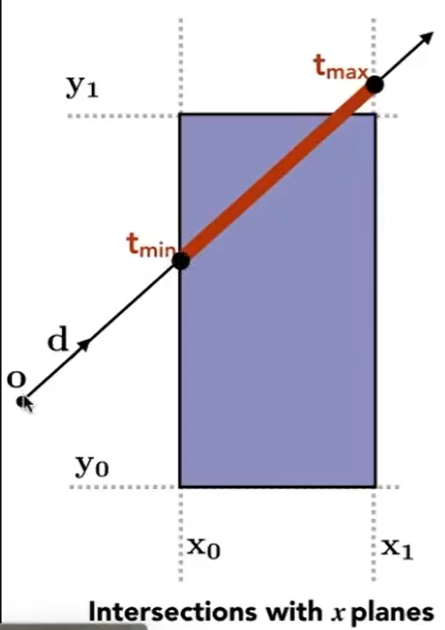

# Ray-Surface 交点

## 定义

光线是一根射线，包含起点和方向，用(o, t)表示，即（起点，方向）  

  

ray equation：  

$$
r(t) = o+td, 0\le t < \infty
$$

## 光线与球的交点

ray: \\(R(t) = o + td\\)  
圆: \\((p - c) ^ 2 - R^2 = 0\\)  
⇒ \\((o + td - c) ^ 2 - R^2 = 0\\)  

  

解出t，根据物理意义可知，t应满足：（1）t是实数，（2）t>0，（3）如果有两个解，取较小的那个

## 光线与隐式曲面的交点

ray: \\(R(t) = o + td\\)  
曲面： f(p) = 0

⇒ f(o + td)=0
解出t

## 光线与显式曲面求交

  

任意一个光线与封闭 mesh 求交，交点个数为奇数则起点在内，交点个数为偶数则起点在外

因此问题转化为光线与mesh上的三角形面片求交点

## 光线与三角形的交点

### 常规方法

- 第一步：光线与三角形面片所在的平面求交点

ray: \\(R(t) = o + td\\)  

  
平面：\\((p-p') \dot N = 0\\)  
平面公式解释：点乘为0代表垂直，N是平面的法向量，p'为平面上任意一点。平面上的点应满足：它与p'的连线与N垂直。    

⇒ \\((o + td - p') \dot N = 0\\)  

解得：\\(t = \frac{(p'- o) \dot N}{d \dot N}\\)  
取t>0的解

- 第二步：判断交点是否在三角形内

(P 37）

### 加速方法（MT）

此方法可以同时求出光线与三角形所在平面的交点且立刻判断点是否在三角形内。  

假设光线与三角形所在平面交点为p，用三角形的重心坐标来表达p为：

$$
p = (1-b_1 - b_2)P_0 + b_1P_1 + b_2P_2
$$

> &#x1F504; [三角形的重心坐标](../Texture/BarycentricCoordinates.md)

同时p也在光线(O+td)上，因此

$$
O + t D = (1-b_1 - b_2)P_0 + b_1P_1 + b_2P_2
$$

其中大写为3D已知向量，小写为未知标量

通过克莱默法则，可解得：

判定结果AC的条件：t>0, b1>0, b2>0, 1-b1-b2>0

  

## 算法加速

Bounding Volumes 包围盒[56：40]

1.长方体，即3个不同的对面（slab）形成的交集[58:36]

AABB = Axis Aligned Bounding Box

  
求光线与每个轴上的对面相交的时间，tmin和tmax

光线进入 AABB 的时间为所有[tmin, tmax] 的交集

tenter = max{tmin}, texit = min{tmax}  

tenter < texit ⇒ 光线与AABB 相交

texit < 0 ⇒ 不相交

tenter < 0 < texit ⇒ 光源在 AABB 内

Q:为什么要用 AABB
A:光线与朋平面求交的计算简单[1:15:49]

普通平面：\\(t = \frac{(p'- o) \dot N}{d \dot N}\\)

AABB平面：\\(t = \frac{(p'_x- o_x) }{d_x}\\)

### 怎样利用 AABB 加速 ray tracing

#### 均匀的格子 Uniform Grids [8：13]

假设：光线与 Grid 求交很快，与 object 求交很慢

1. 找到场景的 Bounding Volumn
2. BV划分成格子
3. 判断每个 Grid 是否有物体
4. 判断光线与 Grid 是否相交，
5. 如果Grid内有 object且光线与Grid相交，再计算光线与 grid 内的 object 是否相交

算法特点：
1. grid 不能太疏或密
2. 适用于 object 的大小接近且位置均匀
3. 不适用于 object 分布不均匀的场景

#### 空间划分 Spatial Partition

[18：59] Octree, KD tree, BSP tree
视频以KD Tree 为例子。

#### KD Tree 的数据结构

- 中间结点

划分轴：x,y,z轴流  
划分点：根据特定的策略选择  
child: 2个  
object: 不存 object 数据

- 叶子结色
 存 list of objects.

#### Traverse.

递归

#### 局限性

1. 如何判断BV与三角形相交。
2. object 存在于多个叶子结点中

## 物体划分 Object Partition

### BVH  [40：00]

优点：解决以上2个问题  
局限性： BV 有重叠，好的划分使重叠尽量少

#### Create

1. 计算 B V
2. 对BV内的obj划分
以上两步交替进行，通常选择对最长的轴进行划分，取中间位置作为划分点。当BV中的三角形个数少于门限时停止

#### Traverse
同上

#### KD Tree VS. BVH [54:25]

------------------------------

> 本文出自CaterpillarStudyGroup，转载请注明出处。  
> https://caterpillarstudygroup.github.io/GAMES101_mdbook/