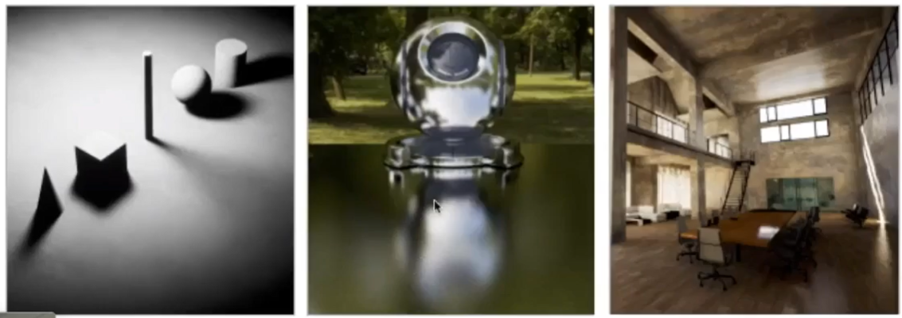

光线追踪与光栅化是两种不同的呈像方式，但光栅化具有“can't handle global effect well”的局限性，不能呈现出以下的效果：  

> &#x2705; 一个像素上所呈现的效果，只与像素附近的几何信息有关，例如position, normal，只是在遮挡的时候考虑了global  
 
  

- 软阴影  
> &#x2705; 考虑来自不同方向的光源  
- glossy反射。glossy是指像有点粗糙的镜子，或打模非常光滑的金属的一种材质  
> &#x2705; 考虑邻居像素的normal  
- 间接光照，即光线弹射不止一次  
> &#x2705; 考虑与其它物理的交互  

因此有了光线追踪技术。

光栅化速度快，质量差， 能达到real-time。光线追踪速度慢，质量好，通常用于offline。

# 光线追踪最基本的假设

1. 光线沿直线传播
2. 光线可以交叉但不发生碰撞
3. 光线从光源出发，经过不断弹射，打入眼中。
4. 光路可逆。可以理解为从眼睛出发，追踪光路直到光源。  

------------------------------

> 本文出自CaterpillarStudyGroup，转载请注明出处。  
> https://caterpillarstudygroup.github.io/GAMES101_mdbook/