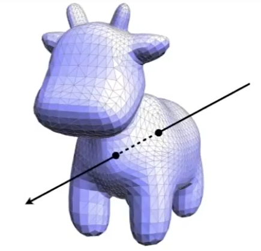

# 光线与三角形的交点

  

任意一个光线与封闭 mesh 求交，交点个数为奇数则起点在内，交点个数为偶数则起点在外

因此问题转化为光线与mesh上的三角形面片求交点

## 常规方法

### 第一步：光线与三角形面片所在的平面求交点

ray: \\(R(t) = o + td\\)  

  
平面：\\((p-p') \dot N = 0\\)  
平面公式解释：点乘为0代表垂直，N是平面的法向量，p'为平面上任意一点。平面上的点应满足：它与p'的连线与N垂直。    

⇒ \\((o + td - p') \dot N = 0\\)  

解得：\\(t = \frac{(p'- o) \dot N}{d \dot N}\\)  
取t>0的解

### 第二步：判断交点是否在三角形内

[link](../Dependency/Vector.md)

## 加速方法（MT）

此方法可以同时求出光线与三角形所在平面的交点且立刻判断点是否在三角形内。  

假设光线与三角形所在平面交点为p，用三角形的重心坐标来表达p为：

$$
p = (1-b_1 - b_2)P_0 + b_1P_1 + b_2P_2
$$

> &#x1F50E; [三角形的重心坐标](../Texture/BarycentricCoordinates.md)

同时p也在光线(O+td)上，因此

$$
O + t D = (1-b_1 - b_2)P_0 + b_1P_1 + b_2P_2
$$

其中大写为3D已知向量，小写为未知标量

通过克莱默法则，可解得：

判定结果AC的条件：t>0, b1>0, b2>0, 1-b1-b2>0

------------------------------

> 本文出自CaterpillarStudyGroup，转载请注明出处。  
> https://caterpillarstudygroup.github.io/GAMES101_mdbook/