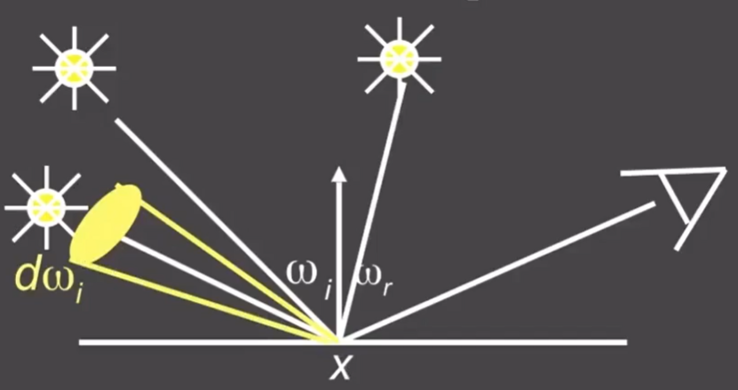

# 渲染方程

Lo(p, wo) = 自己发光 + 来自其它的反射或直射光。  

$$
L_o(p,w_o) = L_e(p,w_o) + \int_{\Omega^+}L_i(p, w_i)f_r(p, w_i, w_r)(n \cdot \omega_i)dw_i
$$

说明：  
\\(H^2\\)或\\(\Omega^+\\)：都是表示半球  
\\((n \cdot \omega_i)\\)：和\\(\cos\theta\\)是一个意思。参考[link](../Dependency/Vector.md)  
定义的积分域为上半球，即不考虑折射。  
第一项：自己发光超某个方向辐射的能量。  
第二项：从各个角度来的反射光或直射光向某个方向辐射的能量。  

# 理解1：1个入射光线。[47:44]

  

$$
L_o(x,w_r) = L_e(x, w_r) + L_i(x, w_i)f(x, w_i, w_r)(n \cdot \omega_i)
$$

> &#x1F446; 原视频公式中有两个错误：  
> 折射光Lr不包含自己发光项。Lo才是reflect和emission之和。  
> 最后一项角度用点号不用逗号。  
> &#x2705; 只考虑一根入射光线的情况不需要积分

# 理解2：多个入射光线 [47：57]

  

$$
L_o(x,w_r) = L_e(x, w_r) + \sum L_i(x, w_i)f(x, w_i, w_r)(n \cdot \omega_i)
$$

把多个入射光的贡献加起来

# 理解3：1个面光源 [48：30]

  

$$
L_o(p,w_r) = L_e(p,w_r) + \int_{\Omega}L_i(p, w_i)f(p, w_i, w_r)(n \cdot \omega_i)dw_i
$$

面光源可以看作是无穷多个小的点光源的积分。  
因此单个点光源的累加变成了\\(d\omega_i\\)的积分。  

# 理解4：来自其它物体的反射光作为入射光线[49:31]

  

x是X物体上的一个点，X'是另一个物体。  
\\(L_r(X', -\omega_i)\\)是X'发出（自身发光或反射）的光以\\(\omega_i\\)角度辐射x  
\\(L_r(X, \omega_o)\\)是X发出（自身发光或反射）辐的光，可能也在以某个角度辐射另一个物体。  

# 递归问题

把“理解4”中的公式简化，得：  

$$
l(u) = e(u) + \int l(v)K(u,v)dv
$$

其中：  
l(u)：未知量  
e(u)：自己发的光  
I(v)：未知量  
K(u,v)dV：材料属性

进一步简化得到公式的算子形式:

$$
L = E + K L 
$$

解得:

$$
L = E + KE + K^2E + k^3E + \dots
$$

其中：  
E：光源直接发出的能量  
KE：光源辐射能量经过一次反射后的能量，又称为直接光照  
\\(K^nE\\)：多次反射，统称为间接光照  
全局光照：直接光照与间接光照的集合  
光栅化中的着色：包含光源和直接光照，不包含间接光照，因此效果有限    

# 效果

- 直接光照

  

- 直接光照 + 1次间接光照

  

------------------------------

> 本文出自CaterpillarStudyGroup，转载请注明出处。  
> https://caterpillarstudygroup.github.io/GAMES101_mdbook/
