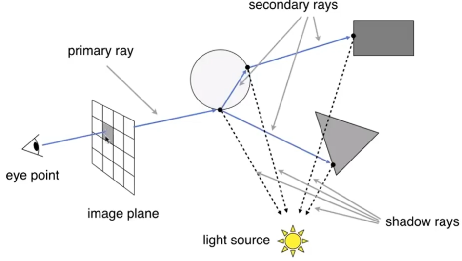
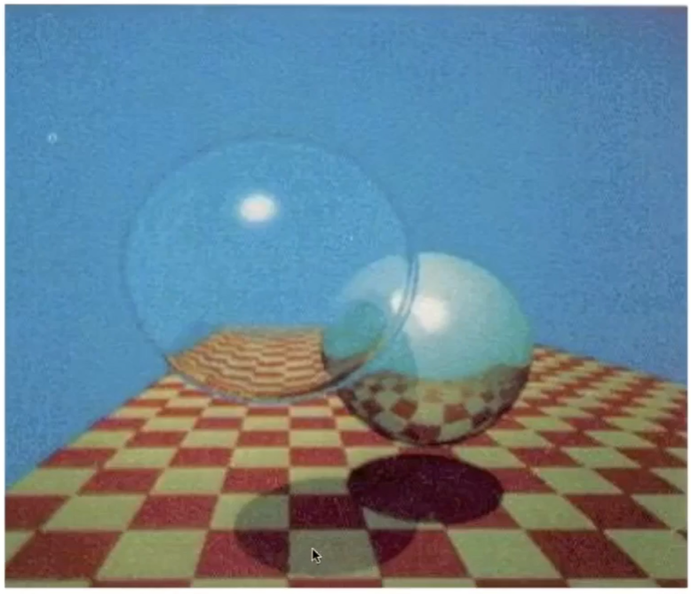

# Whitted-风格算法(递归)

## 假设

1. 光源是点光源。
2. camera 是一个点
3. 折射 + 反射
4. 可以无限次弹射

## 具体步骤

  

[23：20]

1. 从眼睛向每个像素投出一根视线(eye ray)
2. 光线和场景相交，求最近的交点
3. 光线在交点与可以发现反射和折射，反射和折射又新形成新的交点。反射能量 + 折射能量 <= 1
4. 所有的交点都称为弹射点。弹射点与光源连线，判断定是否在阴影中 
5. 所有弹射点的着色求和[26：23]  
6. 写回像素值

## 一些名词

- primary ray：眼睛打出的光线  
- secondary ray： 经过弹射的光线  
- shadow ray：物体与光源的连线  

## 效果

  

------------------------------

> 本文出自CaterpillarStudyGroup，转载请注明出处。  
> https://caterpillarstudygroup.github.io/GAMES101_mdbook/