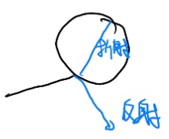

# Whitted-风格算法(递归)

[23：20]

1. 经过反射和折射会经过多个弹射点[25:25]
2. 对每个弹射点都计算着色的值[25：42]
3. 如果某个弹射点能被光源照时，其着色值都会被加到所看的像素上去[26：23]

反射能量 + 折射能量 = 1

一些名词： primary ray, secondary ray, shadow ray

------------------------------

> 本文出自CaterpillarStudyGroup，转载请注明出处。  
> https://caterpillarstudygroup.github.io/GAMES101_mdbook/