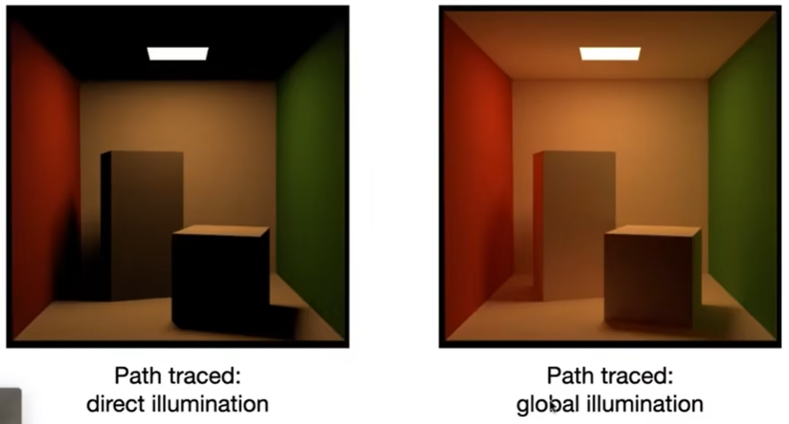

# Whitted-Style Ray Tracing 的局限性[20:40]

> &#x1F50E; [Whitted-Style Ray Tracing](Whitted.md)  

1. 光线打到光滑材质，会发生镜面反射。 

因此只能做出镜面反射的效果，无法处理Glossy材质的反射效果  

2. 光线打到透明物体，会折射  
3. 光线打到普通物体，会漫反射，然后停止  

  

光线打到漫反射表面后就不在弹跳了，导致光源没有直接照的地方是黑的，例如天花板和物体的侧面。实际上漫反射的光线也应该继续弹跳，照亮天花板。左边的墙上的光线弹到对面的物体上，使物体侧面也呈现出红色(color bleeding效果)。    

Whited Style 算法有局限性，但 rendering 公式是正确的。正确解出 rendering 公式，会得到正确的算法。

------------------------------

> 本文出自CaterpillarStudyGroup，转载请注明出处。  
> https://caterpillarstudygroup.github.io/GAMES101_mdbook/