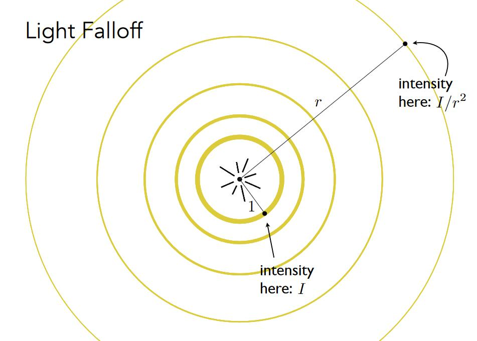
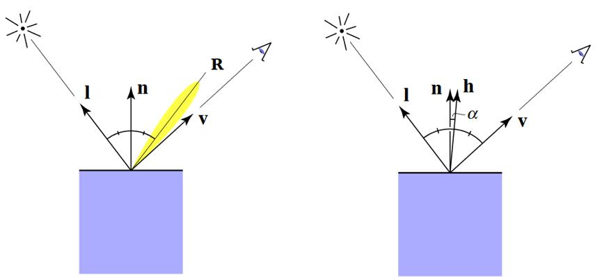
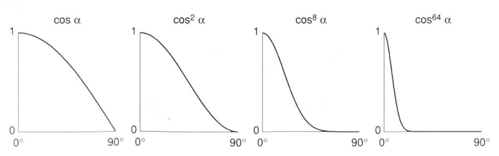

# Blinn-Phong 反射模型

这是一个简单基础的模型，属于经验模型，并不完全符合物理。  
它将光分成了三种成分，分别针对这三种成分的光，模拟光源对物体的作用。  

- 高光(Specular highlights): 光线反射到镜面反射附近
- 漫反射(Diffuse reflection): 光线被反射到各个方向上
- 环境光(Ambient lighting): 假设任何一个点会接收到来自环境的常­量的光

# 定义

  

- shading point：当前要计算着色的点，位于物体表面。物体在shading point处的属性包含color, shinness。  
- （\\(\hat{n}\\)）Surface normal：假设点附近极小范围内是一个平面，n为平面指向外的法向量
- （\\(\hat{v}\\)）Viewer direction：观测方向
- （\\(\hat{l}\\)）Light direction：光源方向，与光照向point的方向相反

> **&#x1F4CC;** \\(\hat{l}\\)如何计算？
> 
> 光源的位置减去shading point的位置，得到向量，然后求出单位长度\\(\hat{l}\\)

# 三种成分

## 漫反射

[47:35]

### 漫反射的特点

漫反射具有以下特点：

1. 打到 point 上的光线被均匀地反射出去（与观测点v没有关系）

  

2. l 与 n 的夹角决定了 point 接收到的光线的强度(Lambert's cosine law)

> &#x1F446; 假设光线是离散的，可以看出，当表面倾斜时，它接收到的光线会变少。理解为接收到的光线的强度变少。

3. [54:48] 圆心是点光源，向外辐射能量。根据能量守恒定理（不考虑传播损耗），每个圆上的能量之和不变，因此某点处的能量与它到光源的距离平方是反比。

  

> &#x2705;如果考虑三维空间，则应该是距离的立方。

### 漫反射项公式

通过以上分析，定义漫反射的能量公式为：

\\[
L_d=k_d\left( I/r^2 \right) \max \left( 0,\boldsymbol{n}\cdot \boldsymbol{l} \right) 
\\]

- \\(L_d\\)： shading point接收到的漫反射能量
- \\(k_d\\)： shading point对光的吸收率 (例如，不同的颜色对光的吸收能力不同)
- \\(\left( I/r^2 \right)\\)： 有多少能量到达了point
- \\(\max \left( 0,\boldsymbol{n}\cdot \boldsymbol{l} \right) \\)： 从正面照射的光，漫反射才有意义 （非正面射入，\\(\boldsymbol{n}\cdot \boldsymbol{l}\\)的值小于零）
- \\(\boldsymbol{n}\cdot \boldsymbol{l}\\)： 表示有多少能量被point接收
- 漫反射与观察者方向无关，因此公式中没有v的体现。

### 漫反射项的效果

## 高光项

### 高光的特点

  

R 为物体镜面反射的方向，当 v 和 R 接近时，会看到高光。

\\(h=\frac{v+l}{||v+l||}\\) 代表了 v+l 的方向， h 称为半程向量 half vector。 [08:25] 当v和R接近时，v+l 的方向(h)与n接近:

> **&#x1F4A1;** 为什么用\\(n\cdot h\\)代替\\(v\cdot R\\)？
>
> 因为\\(n\cdot h\\)更容易计算

### 高光项的公式

通过以上分析，定义高光项的能量公式为：

\\[
L_s=k_s\left( I/r^2 \right) \max \left( 0, \cos \alpha \right) =k_s\left( I/r^2 \right) \max \left( 0, n\cdot h \right) ^p
\\]

- \\(k_s\\) 吸收率，通常认为高光是白色，也就是全吸收
- \\(\left( I/r^2 \right)\\) 表示有多少能量到达了point
- \\(\max \left( 0, n\cdot l \right) ^p\\) 表示n和h的接近程度
- \\(L_s\\) 同样应该考虑有多少有多少能量被接收，但Blinn Phong模型将这个因素简化了

> **&#x1F4A1;** 公式中为什么会有指数p？
>
> 在保证函数趋势不变的同时，让高光更集中，通常取[100, 200]
>
> 

### 高光项的效果

   

> &#x1F446; 漫反射项 + 高光项

Ks变大，高光变亮。p变大，高光范围变小。

## 环境光照项

Blinn Phong模型假设所有 point 接收到来自环境光的强度相同，且为常数:

\\[
L_a=k_aI_a
\\]

与\\(l\\)和\\(v\\)无关

# 模型总述

\\[
L=L_a+L_d+L_s=k_aI_a+k_d\left( I/r^2 \right) \max \left( 0,n\cdot l \right) +k_s\left( I/r^2 \right) \max \left( 0,n\cdot h \right) ^p
\\]

> **&#x1F4A1;** 为什么不考虑point到v的距离对能量的影响？？
>
> 这部分比较复杂,Blinn-phong模型没有考虑这个问题

------------------------------

> 本文出自CaterpillarStudyGroup，转载请注明出处。
> https://caterpillarstudygroup.github.io/GAMES101_mdbook/