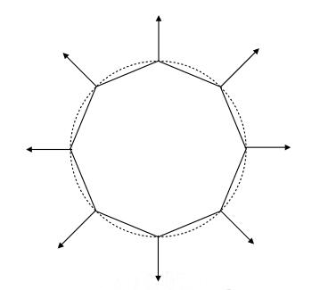
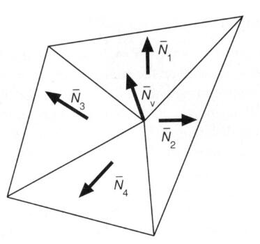

# 计算一个点的法向量

## 方法一：利用几何特征

例如，已知object是个球体。可直接球出球表面某点的n（法向量）

## 方法二：利用三角形面片

\\[
N_v=\frac{\sum{N_i}}{||\sum{N_i}||}
\\]

相邻的三角形的n的平均或加权平均

> **&#x1F4CC;** 一个点可做多个三角形的顶点，将这些三角形（面）的法向量求均值，可简单的看做是这个点的法向量

如果考虑加权平均，则把三角形的面积做为权重。  

# 计算一个像素的法线

先求出顶点的法线，再利用**重心坐标**做插值。

------------------------------

> 本文出自CaterpillarStudyGroup，转载请注明出处。  
> https://caterpillarstudygroup.github.io/GAMES101_mdbook/