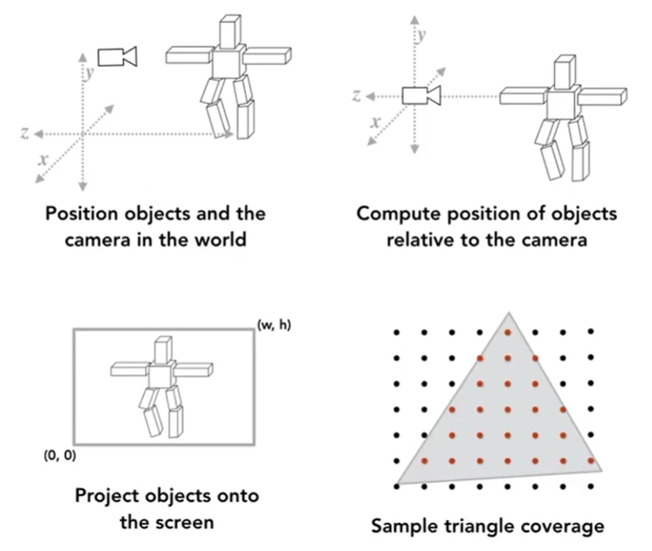

# Shading 着色

>  &#x1F446; 把前面的步骤串起来，是这样子的过程

经过前面这些步骤后，能这得到这样的结果：

>  &#x1F446; （左）不考虑着色的效果；（右）期望达到的效果。

纯色立方体的每个面每个时刻呈现的颜色有变化。使整体效果更真实。

> **&#x1F4CC;** 为什么纯色物体的不同时刻和不同位置，其颜色看不去会不同？  
> 答：颜色是差别是物体的材质与光源作用的结果。同一时刻，不同位置上的像素点，与光源的关系不同，呈现的颜色就会不同。不同时刻，光源发生了变化，同一像素点与光源的关系也变了，导致呈现出的颜色的变化。  

根据物体的材质，以及物体与光源的关系，对物体的颜色加以调整，这个过程就是着色。  

即：The process of applying a material to an object.

本课程中不包含给object添加投影的过程。

------------------------------

> 本文出自CaterpillarStudyGroup，转载请注明出处。  
> https://caterpillarstudygroup.github.io/GAMES101_mdbook/