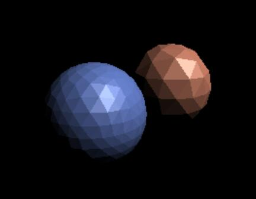
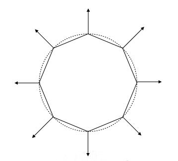
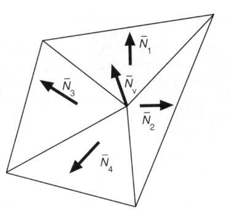

# Shading 着色

（左）不考虑着色的效果；（右）期望达到的效果。

纯色立方体的每个面每个时刻呈现的颜色有变化。使整体效果更真实。

> **&#x1F4CC;** 为什么纯色物体的不同时刻和不同位置，其颜色看不去会不同？  
> 答：颜色是差别是物体的材质与光源作用的结果。同一时刻，不同位置上的像素点，与光源的关系不同，呈现的颜色就会不同。不同时刻，光源发生了变化，同一像素点与光源的关系也变了，导致呈现出的颜色的变化。  

根据物体的材质，以及物体与光源的关系，对物体的颜色加以调整，这个过程就是着色。  

即：The process of applying a material to an object.

本课程中不包含给object添加投影的过程。

# 着色频率

[20:50]

1. 着色应用于一个平面上,整个平面共用一个L（Flat Shading）
   
   

2. 着色应用三角形面片的顶点上，每个顶点计算一个L，三角形内通过插值计算出L（Gouraud Shading）
   
   

3. 着色应用于像素，每个像素计算一个L（Phong Shading）
   
   

不同着色频率和着色几何体的效果比较：

  

## 计算一个点的法向量

方法一：利用几何特征

例如，已知object是个球体。可直接球出球表面某点的n（法向量）

方法二：利用三角形面片

[30:08]

\\[
N_v=\frac{\sum{N_i}}{||\sum{N_i}||}
\\]

相邻的三角形的n的平均或加权平均

> **&#x1F4CC;** 一个点可做多个三角形的顶点，将这些三角形（面）的法向量求均值，可简单的看做是这个点的法向量

方法三：利用插值

[31:29]

------------------------------

> 本文出自CaterpillarStudyGroup，转载请注明出处。
>
> https://caterpillarstudygroup.github.io/GAMES101_mdbook/