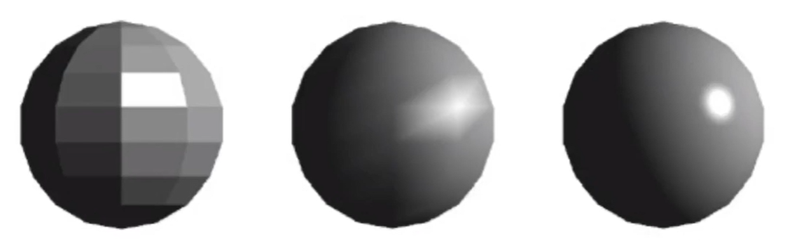

# 着色频率

BlinnPhong模型描述了单点如何着色。  
着色频度描述如果对所有点着色。即以什么样的策略对每个点运用BlinnPhong。或者说，是对哪些点应用Blinn Phong  

对于同一个几何模型，不同的着色频率会产生不同的效果：

以下是几种不同的着色频率（着色策略）：

## 着色应用于平面（Flat Shading）

着色应用于一个平面上。一个平面只做一次shading，整个平面都用这个shading的结果。
   
   

## 着色应用于顶点（Gouraud Shading）

着色应用三角形面片的顶点上，每个顶点先计算法向再计算着色，三角形内通过插值计算出着色
   
   

## 着色应用于像素（Phong Shading）

着色应用于像素，每个像素都计算法向与着色
   
   

# 比较

不同着色频率和着色几何体的效果比较：

  

从上往下，几何形体本身越来越细腻光滑。  

结论：  
1. 当几何足够复杂时，可以使用相对简单的着色频率。  
2. 当几何简单时，Phong Shading计算量大。当几何足够复杂时，例如顶点数多于像素数时，Flat Shading的计算量更大。

------------------------------

> 本文出自CaterpillarStudyGroup，转载请注明出处。  
> https://caterpillarstudygroup.github.io/GAMES101_mdbook/