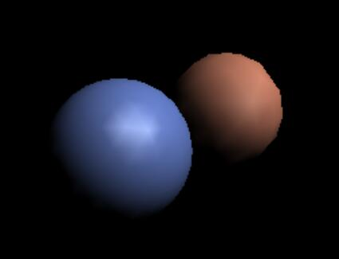
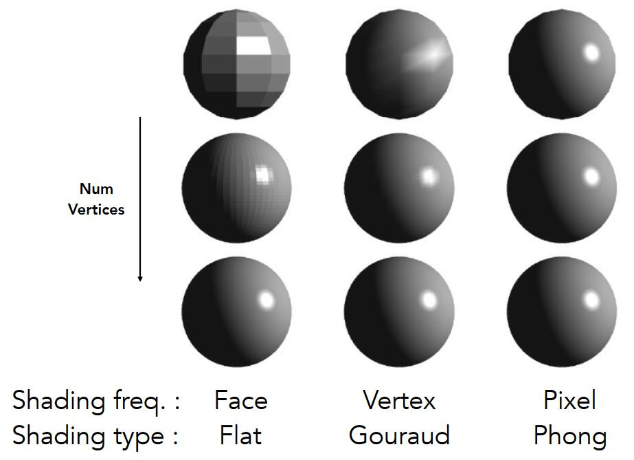

# 着色频率

[20:50]

1. 着色应用于一个平面上,整个平面共用一个L（Flat Shading）
   
   

2. 着色应用三角形面片的顶点上，每个顶点计算一个L，三角形内通过插值计算出L（Gouraud Shading）
   
   

3. 着色应用于像素，每个像素计算一个L（Phong Shading）
   
   

不同着色频率和着色几何体的效果比较：

  

------------------------------

> 本文出自CaterpillarStudyGroup，转载请注明出处。
>
> https://caterpillarstudygroup.github.io/GAMES101_mdbook/