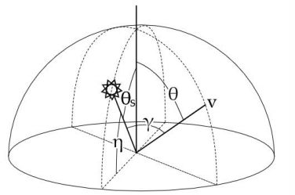
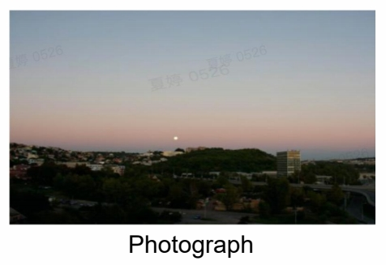
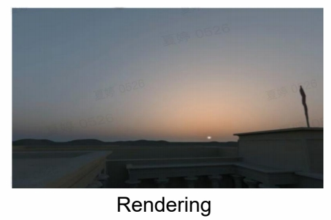

# Analytic Atmosphere Appearance Modeling

> 这是一种类似 Bling Phong 的经验模型。以下公式都是作者根据经验假设的。   

## 经验公式

$$
\mathbb{F} (\theta ,\gamma )=(1+Ae^{\frac{B}{\cos \theta +0.01}})\cdot (C+De^{E\gamma }+F\cos ^2\gamma +G\cdot \chi (H,\gamma )+I\cdot \cos ^ {\frac{1}{2} }\theta )  
$$

$$
L_\lambda =\mathbb{F} (\theta ,\gamma )\cdot L_{M\lambda} 
$$

   

## Summary

**Pros**    
- Calculation is simple and efficient    

**Cons**   
- Limited to ground view   
- Atmosphere parameters can’t be changed freely    

## Result

   

   

> An Analytic Model for Full Spectral Sky-dome Radiance, ACM Trans 2012    

---------------------------------------

> 本文出自CaterpillarStudyGroup，转载请注明出处。  
> https://caterpillarstudygroup.github.io/GAMES101_mdbook/