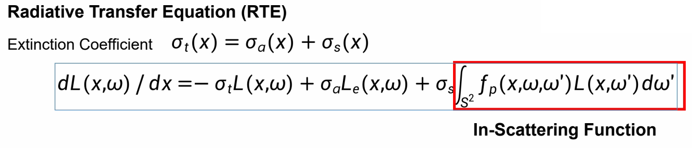
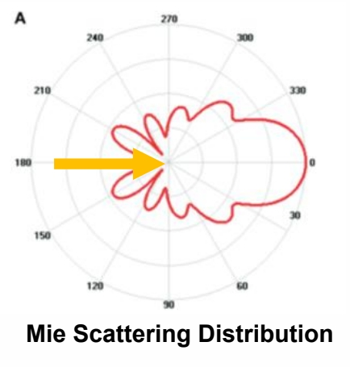
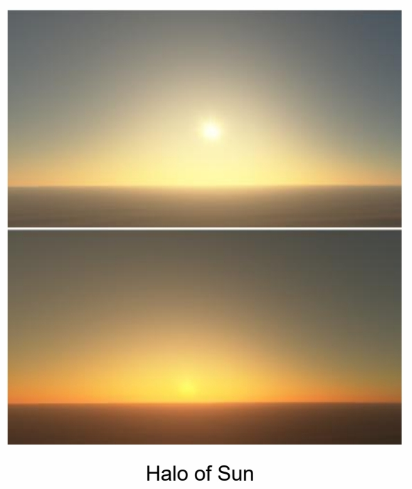

# Atmosphere

P62   
## Participating Media

### 大气粒子的种类

- Volume filled with particles    
- Interact differently with light depending on its composition   

  

> 大气层有两种粒子构成:  
(1) 各种气体分子   
(2) 气溶胶     
这些是光的介质，是产生各种光学现象的原因。    

> 气体分子直径远小于光的波长，气溶胶的直径与光的波长相似，因此表现出完全不同的视觉效果，也对应两种不同的模型。    

P63    
### How Light Interacts with Participating Media Particles?

   

> (1) 吸收 (2) 散射 (3) 自发光    

   

P64    
### Volume Rendering Equation (VRE)

  

  

> (1) 通透度 (2) 有多能量向视线方向辐射    

## 气体分子散射模型 - **Rayleigh Scattering**
 
Scattering of light by particles that have a diameter **much smaller than** the wavelength of the radiation (eg. air molecules)     

Rayleigh，用于气体分子。特点：    
1. 均匀散射    
2. 波长越短(紫)，散射越多    
3. Certain directions receive more light than others front-back symmetry    
- Shorter wavelengths (eg. blue) are scattered more strongly than longer wavelengths (eg. red)    

  

### Rayleigh Scattering Equation

  

> \\(\lambda\\)：波长。\\(\theta\\)：夹用。\\(h\\)：海拔高度。   

P69   
### Why Sky is Blue

  

## 气溶胶散射模型 - **Mie scattering**   

Scattering of light by particles that have a diameter **similar to or larger than** the wavelength of the incident light (eg. aerosols)    

Mie，用于气溶胶。特点：    
1. 有方向性，沿着光的方向会强一点   
2. 对波长不敏感。      

  

P71   
### Mie Scattering Equation

  

- g > 0, scatters more forward Mie scattering    
- g < 0, scatters more backward   
- g = 0, Rayleigh scattering   

  

P72    
### Mie Scattering in Daily Life

- Exhibit a strong forward directivity (halo effects around sun)    
- Scatter light of all wavelength nearly equally (fog effects)    

  

  

P73   
> \\(O_3\\) 和 \\(CH_4\\) 吸收短波，使物体表现出蓝色。    
假设空气中 \\(O_3\\) 和 \\(CH_4\\) 是均匀分布的。   

