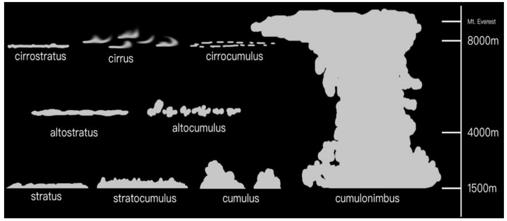
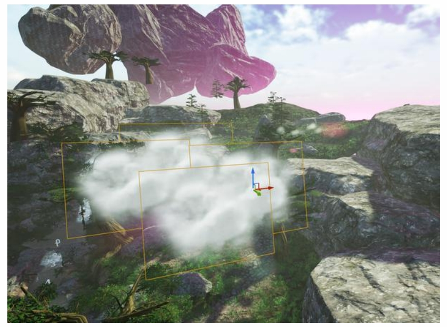
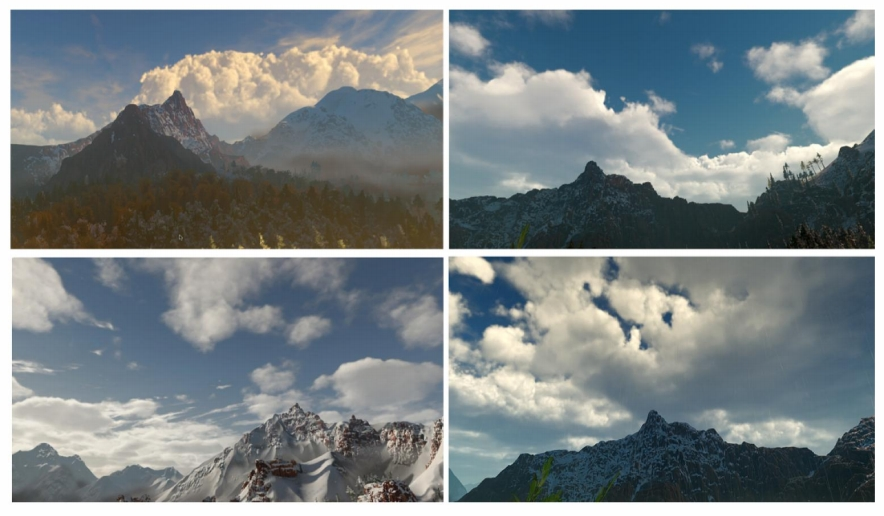
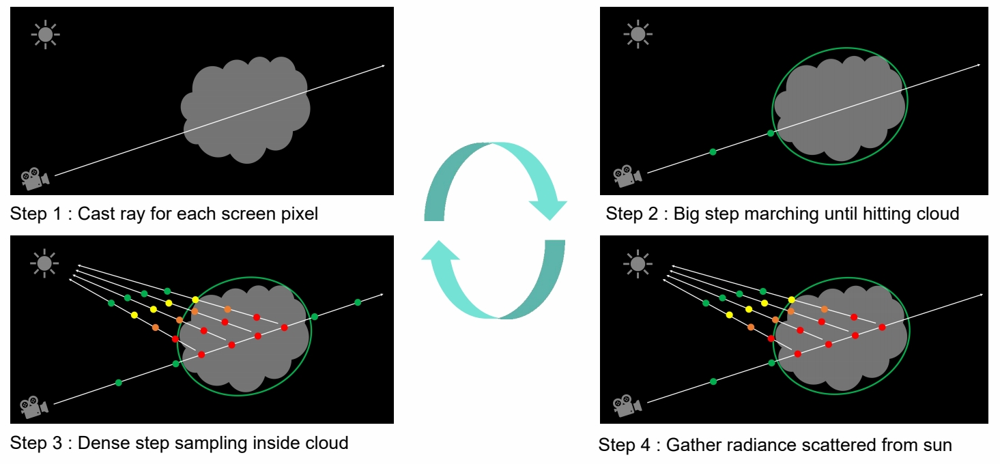

 
# "Paint" Cloud
  
## Cloud Type

  
  
## Mesh-Based Cloud Modeling

> Mesh＋腐蚀等算法。   

  

**Pros**   
- High quality   

**Cons**   
- Overall expensive   
- Do not support dynamic weather   

现在已经没人用了。      

## Billboard Cloud

> 半透明插片＋\\(\alpha \\) 混合    
十年前常用     

**Pros**   
- Efficient   

**Cons**   
- Limited visual effect   
- Limited cloud type    

  
  
## Volumetric Cloud Modeling

  

**Pros**    
- Realistic cloud shapes    
- Large scale clouds possible    
- Dynamic weather supported    
- Dynamic volumetric lighting and shadowing   
> 优点：(1) 全动态，CPU 实时生成。(2) 云可以表现出很多变化    

**Cons**   
- Efficiency must be considered    

> 局限性：(1) 复杂 (2) expensive    
 
## Weather Texture

  

  

>  texture＋厚度 channel    
对 texture 做挠动可以产生云的变化。     

### Noise Functions

  

  

### Cloud Density Model

  

>  用低频 noise 雕刻出造型，再用高频加上细节。    

## Rendering Cloud by Ray Marching

  

> 不会把云转成 Mesh 去渲染，而是当作大气来渲染。     
但由于云的通透性很低，可以对公式作大量假设和简化。     

---------------------------------------

> 本文出自CaterpillarStudyGroup，转载请注明出处。  
> https://caterpillarstudygroup.github.io/GAMES101_mdbook/