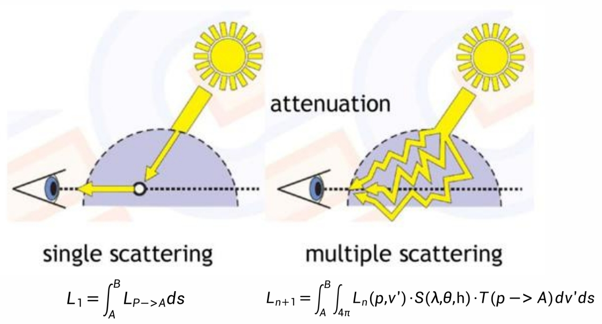

P74   
# Single Scattering vs. Multi Scattering

  

> Multi Scattering 现象与 GI 不同。因为空气中的粒子充满整个空间，所以 MS 的效果是连续的。    

P76    
## Ray Marching

- **Ray marching** is a popular method to integrate function along a path   
- We use ray marching to calculate final radiance for a given point by single scattering   
- The integrated radiance is usually stored in **look-up tables (LUT)**   

  

P77   
## Precomputed Atmospheric Scattering

  

<https://ebruneton.github.io/precomputed_atmospheric_scattering/>  

> 空间采样、预计算、查表。     

P78   
## Precomputed Atmospheric Scattering

  

> 人的视角 (2D)＋阳光角度 (2D) ＝4D    
如何参数化地表达 4D 数据    

P79   
## Precomputed Atmospheric Scattering

**Multi Scattering LUT**

  

> 一般 N 取 3-4 够用了。预计算部算好，实时部分变得简单高效
非常经典的方法。    
大气环境不变前提下，人和太阳可以在任意位置，都能有比较好的效果。    

P81    
## Challenges of Precomputed Atmospheric Scattering

- Precomputation Cost    
  - Multi-scattering iterations are very expensive   
  - Hard to generate atmosphere LUT on low-end devices (ie. mobile)   
- Authoring and **Dynamic Adjustment of** Environments   
  - Artist can't change scattering coefficients on the fly   
  - Hard to render effects like weather from sunny to rain fog, space travel among planets   
- Runtime Rendering Cost   
  - Expensive **per-pixel multi high dimensional texture sampling** for transmittance LUT and multi scattering LUT (always need to down-sample for efficiency)   

**A Scalable and Production Ready Sky and Atmosphere Rendering Technique**     
<https://diglib.eg.org/bitstream/handle/10.1111/cgf14050/v39i4pp013-022.pdf>    

P82   
## Production Friendly Quick Sky and Atmosphere Rendering

Simplify Multi-scattering Assumption   
- Scattering events with order greater or equal to 2 are executed using an **isotropic phase function**   
- All points within the neighborhood of the position we currently shade **receive the same amount of second order scattered light**   
- **Visibility is ignored**     

$$
G_{n+1}=G_n\ast f _{ms}
$$

$$
\mathbf{ F_{ms}=1+f_{ms}+f^2_{ms}+f^3_{ms}+\dots = \frac{1}{1-\mathbf{f_{ms}} } }
$$

$$
\mathbf{\Psi _ {ms} }=\mathbf{L_ {2^{nd}order} F_ {ms} }
$$

> 假设“散射是各向同性的”。那么，“均匀的入射光到均匀的出射光”的过程，只是一个简单的能衰减过程。所以只需要求出衰减比例，每 bounce 一次就按这个比例衰减就可以了。    

P83   
## Production Friendly Quick Sky and Atmosphere Rendering

Fixed view position and sun position to remove 2 dimensions out of LUT   

  

> 对上文中的 LUT 的简化：    
(1) 假设人所在的高度不变，去掉 height 维    
(2) 假设太阳位置不变，去掉入射角的维度仅留下出射光的维度(天顶角、环角)     

P84    
## Production Friendly Quick Sky and Atmosphere Rendering

- Generated a 3D LUT to evaluate aerial-perspective effects by ray marching    

  

> 这个方法不保证物理正确，但好处是：    
(1) 艺术家友好      
(2) 可以创造异星世界效果     
(3) 硬件友好     

P85    
## Good Balance of Performance and Effect

- Scalable from mobile to high-end PCs

  

Performance for each step of method, as measured on PC (NV 1080) and a mobile device (iPhone 6s)    

P87   
## "Paint" Cloud

P88    
## Cloud Type

  

P89   
## Mesh-Based Cloud Modeling

  

**Pros**   
- High quality   

**Cons**   
- Overall expensive   
- Do not support dynamic weather   

> Mesh＋腐蚀等算法。    
现在已经没人用了。      

P90   
## Billboard Cloud

**Pros**   
- Efficient   

**Cons**   
- Limited visual effect   
- Limited cloud type    

  

> 半透明插片＋\\(\alpha \\) 混合    
十年前常用     

P91    
## Volumetric Cloud Modeling

  

**Pros**    
- Realistic cloud shapes    
- Large scale clouds possible    
- Dynamic weather supported    
- Dynamic volumetric lighting and shadowing   

**Cons**   
- Efficiency must be considered    

> 优点：(1) 全动态，CPU 实时生成。(2) 云可以表现出很多变化    
局限性：(1) 复杂 (2) expensive    

P92    
## Weather Texture

  

  

>  texture＋厚度 channel    
对 texture 做挠动可以产生云的变化。     

P93   
## Noise Functions

  

  

P94    
## Cloud Density Model

  

>  用低频 noise 雕刻出造型，再用高频加上细节。    

P95    
## Rendering Cloud by Ray Marching

  

> 不会把云转成 Mesh 去渲染，而是当作大气来渲染。     
但由于云的通透性很低，可以对公式作大量假设和简化。     