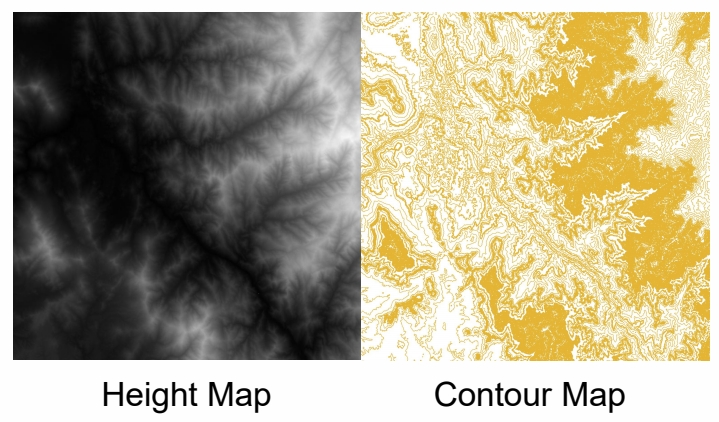
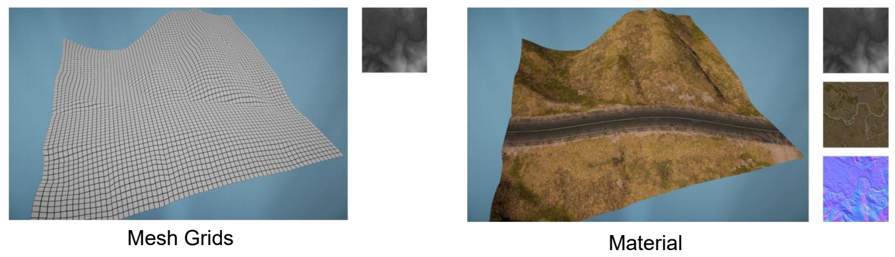
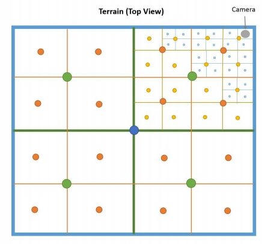
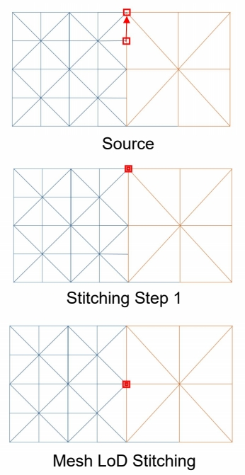
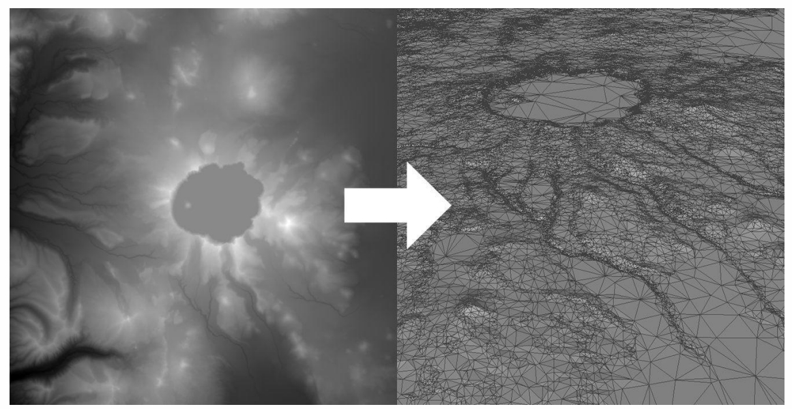

 
# Heightfield

   
  
## Render Terrain with Heightfield

### 朴素方法

   

>    

存在的问题：数据量巨大    

### Adaptive Mesh Tessellation - Level Of Detail     

与角色 LOD 不同的是，地形是连续的。  

   

因此在同一个地形里同时存在不同的LOD。  

#### Golden Rules of LOD

(1) 近处密集，远处稀疏    
(2) FOV 小密集，FOV 大稀疏    
(3) 地型起伏大(有明显误差)密集，起伏小稀疏     

## Mesh Subdivision 

### Triangle-Based and T-Junctions    

Continuously partitioning triangles and their    
children based on the idea of binary trees     

   
  
> T-Junction：一条边的两边切分不一致导致的 BuG。    
解决方法：强制稀疏侧向密集侧对齐    

### QuadTree-Based Subdivision

> 三角形不符合构建地形的直觉，更常用是四边形。 

   

**Pros**    
- Easy to construct     
- Easy management of data under geospatial, including objects culling and data streaming     

**Cons**    
- Mesh subdivision is not as flexible as triangle mesh    
- The grid level of the leaf nodes needs to be consistent   

> 也会有 T-Junctions 问题。解决方法：吸附。    
吸附不改变数据结构，实现更容易。       

      

### Triangulated Irregular Network (TIN)

> 把 height field 转化为不规则三角形。  

   
 
**Pros**   
- 与地形特征更匹配(顶点的位置)，Easy in runtime rendeirng   
- Less triangls in certain terrain types   

**Cons**    
- Requires certain pre-processing steps   
- Poor reusability   
但实际上不常用。  

---------------------------------------

> 本文出自CaterpillarStudyGroup，转载请注明出处。  
> https://caterpillarstudygroup.github.io/GAMES101_mdbook/