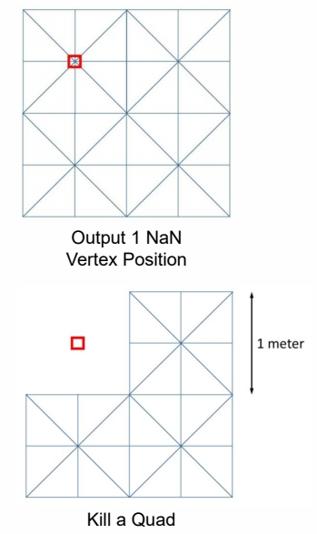

# Non-Heightfield Terrain

> 处理有山洞的地形    
## 方法1：在普通地形上放一个山洞或桥。   

P31   
## 方法2：Dig a Hole in Terrain

通过将顶点设为无效值的方式把洞口的面片删掉，

   

再放一个隧道的模型上去。 

P32   
## 方法3：Volumetric Representation

In 3D computer graphics, a voxel represents a value on a regular grid in three-dimensional space. As pixels in a 2D     
bitmap, voxels themselves do not typically have their position (i.e. coordinates) explicitly encoded with their values     

> 用体素来表达世界，并用一个值来描述每个体素上是否有物质以及物质的密度。    
再有 [Marching Cube]() 将其转为 Mesh。    
实操时，考虑到水密性、LOD 等因素，会稍微复杂一点。     
 

---------------------------------------

> 本文出自CaterpillarStudyGroup，转载请注明出处。  
> https://caterpillarstudygroup.github.io/GAMES101_mdbook/
