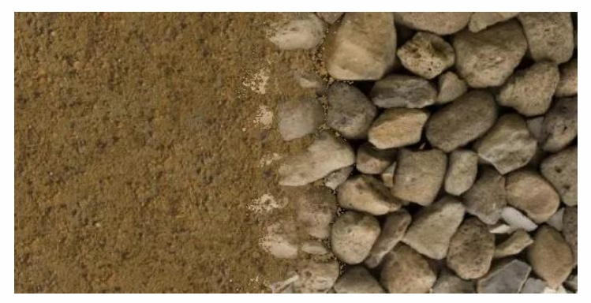
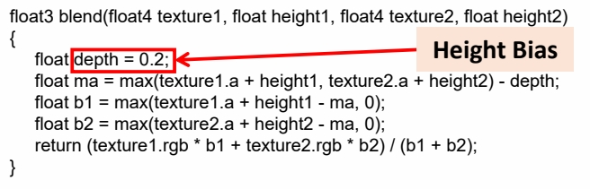
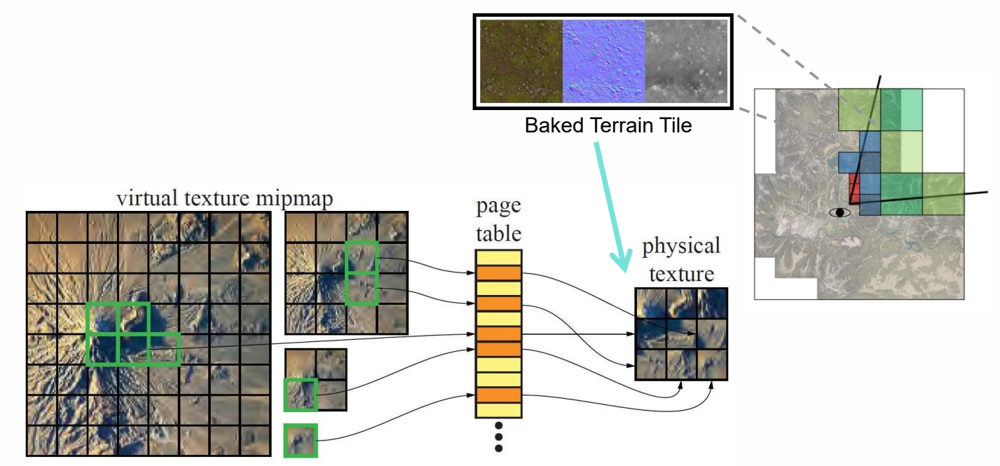

P36    
# Paint Terrain Materials

P38    
## Terrain Materials Splatting

> Splat Map：每一个 channel 定义了一种材质的权重。又称为材质混合。 

   

P39    
### Simple Texture Splatting

简单的Texture Splatting会混合出为种效果：

   

> 但真实的材质过渡不是这种柔和渐变的过渡，而应该是这种：

   

P40    
### Advanced Texture Splatting

> 解决方法：利用 height 调整权重    

   

```
float3 blend(float4 texture1, float height1, float4 texture2, float height2)    
{    
return height1 > height2 ? texture1.rgb : texture2.rgb;    
}       
```

   

P41    
### Advanced Texture Splatting - Biased

> 存在的问题，相机移到时有抖动现象 
解决方法：引入 height bias     

   

   

> **Links:** <https://www.gamedeveloper.com/programming/advanced-terrain-texture-splatting>    

P42   
### Sampling from Material Texture Array

   

> 实践中会用到很多帧图，通常把它们 patch 成 Texture Array。   

P44    
### Expensive Material Blending    

- **Many Texturing** - Low performance when multiple materials are sampled too many times    

- **Huge Splat Map** - We only see a small set of terrain, but we load splat maps for 100 square km into video memory      

   

> 整个场景包含很多纹理，Texture Array 涉及内存的来回寻址，效率比较低。但实际上一个像素会用到的纹理种类很少。

P45    
## Virtual Texture

- Build a virtual indexed texture to represent all blended terrain materials for whole scene    
- Only load materials data of tiles based on view- depend LOD   
- Pre-bake materials blending into tile and store them into physical textures   

   

> 思想，只把用到的纹理加到内存、其它的纹理放在硬盘中。类似于mipmap＋oS 分页机制。    
优点：(1) 极大地减少了显存的占用    
(2) 像素的 blending，在 tile 被加载到内存时算好就不动了，直到这个 tile 被置换出内存。    

**这个是目前的主流方法**。  

P47    
# Floating-point Precision Error

> 浮点数的精度溢出    
float 存储数据时，数值越大精度越低。精度太低就会引起抖动。    
地图太大时，这种情况很常见。   

P48    
## Camera-Relative Rendering

> 解决方法：坐标系调整到相机中心(很多引擎的标准做法)
仿真时也会有同样的问题。  

- Translates objects by the negated world space camera position before any other geometric transformations affect them    
- It then sets the world space camera position to 0 and modifies all relevant matrices accordingly    

  

