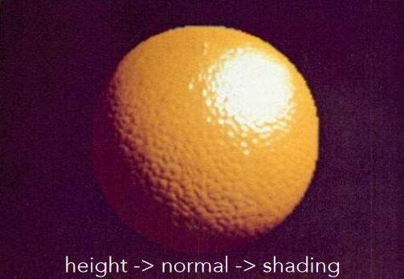
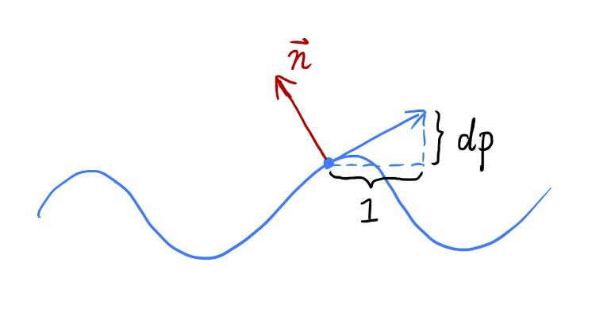
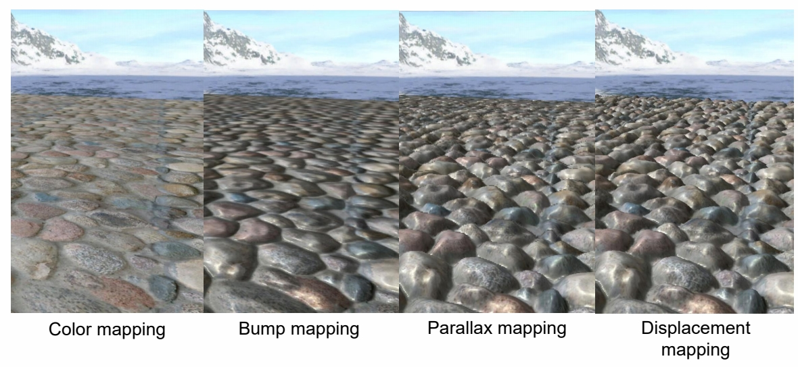

# 2D纹理应用

纹理，原义为贴图。广义上，纹理=内存 + 范围查询（滤波）。通过这样的技术，可以得到很多实用的功能。

## 凹凸贴图 - 用复杂纹理代替复杂几何

### 凹凸贴图 - 用纹理记录顶点的高度偏移

#### 原理

用纹理定义某个点的相对高度，在物体几何信息不变的条件下，得到视觉上的表面凹凸效果，即：用复杂纹理代替复杂几何

原理：影响高度-->影响法线-->影响着色

#### Bump Mapping

效果：

#### 具体步骤

- 以2D为例

黑色为原始几何信息。桔色为叠加高度偏移之后的几何信息。由于高度变化带了法线的变化，p点的法线变成了n。如何计算新的方向n？  

1. 在p点定义局部坐标系，令原始法线方向向上，为(0,1)或(0,0,1)
2. 想要让p表现出在p'处的效果，需要计算出在局部坐标系下，p'处的切线方向和法线方向  
假设p点沿当前方向向右移动了距离dx，那么它会向上移动dy。切线方向就是(dx, dy)。为了简化计算，令dx=1，只需要求出此时的dy（也就是dp）即可。   

$$
dp = c \cdot [h(p+1) - h(p)]
$$

c是一个超参，用于控制高度位移的影响大小。  

3. 根据dp（通过纹理记录的值），直接使用dp就可以得出p'处的切线方向和法线方向

> &#x2705; 如果dp是通过高度偏移算出来的，则称为凹凸贴图。如果dp是直接从纹理中查出来的，则称为法线贴图。  

切线方向是(1, dp)，对应的法线方向是(-dp, 1)。

4. 第一步中把世界坐标系转成了局部坐标系，以保证原始的法线方向是向上的，便于计算。现在要把局部坐标系的法线方向转回到世界坐标系中。

5. 根据新的法线做shading

- 3D

$$
dp/du = c1 \cdot [h(u+1) - h(u)]  \\\\
dp/dv = c1 \cdot [h(v+1) - h(v)]
$$

||2D|3D|
|---|---|---|
|p的法线方向|(0,1)|(0,0,1)|
|p'的切线方向 |(1,dp)|(1, dp/du, dp/dv)|
|p'的法线方向 |(-dp, 1)| (-dp/du, -dp/dv, 1)|

> &#x2757; 方向算出来之后需要归一化。 
 
### 法线贴图 - 用纹理记录顶点的法线

与凹凸帖图类似，也是为了达到以假乱真的效果。

> &#x1F4A1; 只是存储的计算结点不同，但都是假的

## 位移贴图 - 用纹理记录顶点的高度偏移

位移贴图和凹凸贴图所记录的信息是一样的。  
区别是，位移贴图会真的移动几何的顶点位置。  

- 位移贴图的优点：  

凹凸贴图只是一种视觉的上欺骗，它会在两个地方露馅：  
1. 边缘是圆的，没有凹凸感
2. 缺少“自己阴影投影到自己身上”  
位移贴图能真实地改变顶点，不会出现以上的问题

> &#x1F4A1; 就好像基于经验公式的渲染一定不如基于物理意义的渲染来的真实。假的总有模仿不了的，这会成为它的局限性，但它能简化问题。  

- 位移贴图的局限性：  

位移贴图要求模型的三角形足够细。因为它只能改变顶点位置。如果三角形比较大，三角形内部的位置就不能改变。   
从采样原理解释就是，模型表面的采样频率应该能跟上纹理变化的频率。  

- 改进：动态三角形细分  

这是应用在direct X里面的一套方法。  
先使用比较粗的模型，在应用纹理的过程中检测并动态地决定是否需要对三角形做细分。

## 用纹理记录之前算好的信息

例如着色、阴影等信息，是可以提前算好，写到纹理图中，然后再应用纹理。

例如上图中，中间图存储了原图的环境光遮蔽信息。这是一个[0,1]的信息，用于表达原图对应位置是否由于被其它部位遮蔽而呈现出较深的颜色。  
应用是把着色结果与这个遮蔽信息相乘。

> &#x1F4A1; 提前准备是空间换时间的通俗表达。提前准备好仍免不了计算，只是把计算提前了，该做的仍然要做。  
> 提前准备好也有可能会有实际上用不到的风险，那么这一部分提前计算会被浪费。提前计算消耗的是廉价的时间和空间，一但用上了，省去的是昂贵的运行时计算的时间，因此是高回报的投资。  

P43   
## Parallax and Displacement Mapping

   

   

Parallax Mapping: Due to the height of the surface, the eye sees point B instead of point A. It creates a sense of dimensionality     

> 视差贴图。    

> 凹凸帧图能产生明暗分明的效果。但仍然会有平面感，因为眼睛看到的点和应该看到的点，有视差。常用做法，ray marching(Parallax mapping)        
缺点：(1) 几步测一下，比较贵     
(2) 只是产生视觉上的凹凸感，边界上还能看出 artifacts (光滑)    
Displacement mapping 真实修改地形     

------------------------------

> 本文出自CaterpillarStudyGroup，转载请注明出处。  
> https://caterpillarstudygroup.github.io/GAMES101_mdbook/
