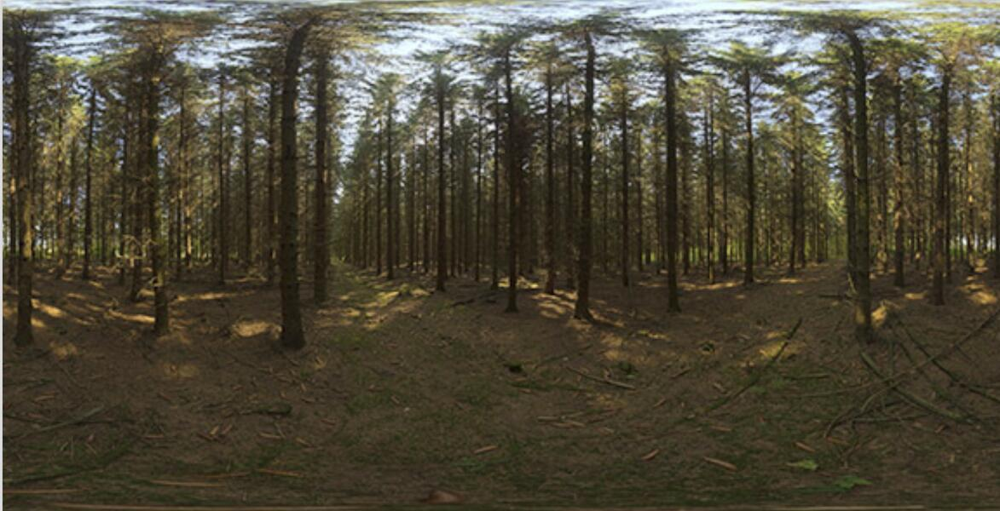
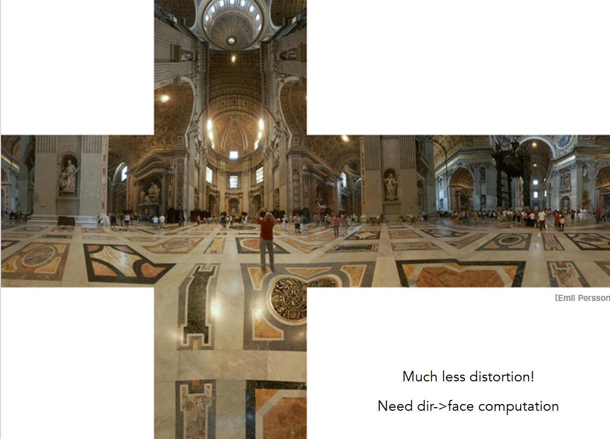
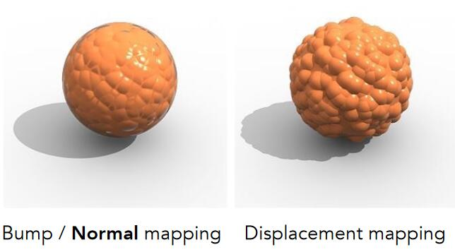

纹理，原义为贴图。广义上，纹理=内存 + 范围查询（滤图）。通过这样的技术，可以得到很多实用的功能。

# 环境光照

以一个点出发，向其四周都能看到光，把这些光记录下来，就是环境光照

用这个环境光照来渲染茶壶

1. 用纹理描述环境光
2. 用环境光渲染其他物体
   
假设环境光的光源无限远，只记录方向信息，不记录深度信息，且在记录光照信息时，不区分光照的种类。

### 应用例子2 

[12:35] Spherical 环境图：

把环境光存储在球面上（左）

并把它展开：

但存在扭曲问题。

### Cube Map

把光照信息存在立方体表面，球表面点和立方体表面点可以一一对应。

并展开：

## 凹凸贴图

用纹理定义某个点的相对高度，在object triangle mesh不变的条件下，得到视觉上的表面凹凸效果，即：用复杂纹理代替复杂几何

原理：高度-->法线-->着色或法线-->着色

### 法线贴图 
Bump Mapping

2D：

切线方向 (1,dp)

法线方向 (-dp, 1)

3D:

切线方向 (1, dp/du, dp/dv)

法线方向 (-dp/du, -dp/dv, 1)

先在p点定义局部坐标系，假原始方向向上，为(0,1)或(0,0,1)

在此局部坐标系中求切线方向和法线方向，求导后再切回实际坐标系。

### 位移贴图

凹凸贴图的局限性：

1. 边缘处会露馅
2. 缺少“自己阴影投影到自己身上”
   
**位移贴图**：

输入：原始mesh，高度贴图

输出：mesh的顶点被改变

代价：要求原始mesh的三角形足够细

改进：动态三角形细分

## 3D纹理

纹理不只有表面，内部也有值，即空间任意一点都有值。

纹理并非实际定义，而是通过noise生成（右）

## 用纹理记录之前算好的信息

好处：很多计算可以提前算好

## 3D纹理用手体积渲染

用于记录3D空间信息

