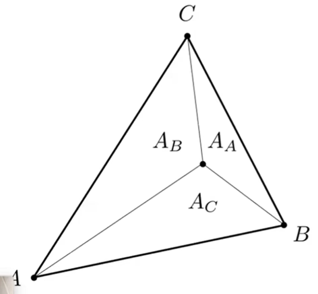

# 插值

为什么需要计算三角形内插值？

答：很多特殊值的计算都是只计算顶点，而内部点的值通过插值可以得到平滑的结果。

插值可以用于哪些数据？

答：纹理坐标、颜色、法向量等

三角形内的插值通常使用**重心坐标**。

# 重心坐标 Barycentric Coordinates

## 什么是重心坐标

重心坐标是定义在一个三角形上的坐标系。具有以下特点：  
1. **重心坐标不是指某个点的坐标值，而是指一个坐标系。与三角形的重心也没多大关系。**
2. 重心坐标定义在一个特定的三角形上。如果换一个坐标系，那么就会得到另一套坐标系。  
3. 用这套坐标系可以描述与三角形同平面的所有的点  
4. 如果某个点在三角形内部，那么它在这个重心坐标系上的表达会满足某些特点。

## 重心坐标的原理  

假设三角形的三个顶点分别是 A、B、C，则**三角形所在平面上的任意一点可描述为A、B、C的线性组合**，即：

\\[
\left( x,y \right) =\alpha A+\beta B+\gamma C
\\]

且

$$
\alpha + \beta + \gamma = 1
$$

在这里，\\((\alpha, \beta, \gamma)\\)就是点(x, y)在这个三角形重心坐标系下的坐标，简称为重心坐标。  

如果这个点在三角形内，还需要满足：\\(\alpha +\beta +\gamma =1\\) ,  \\(\alpha \geqslant 0, \beta \geqslant 0,\gamma \geqslant 0\\)

## 特殊点的重心坐标

- 顶点的重心坐标

\\[
A=\left( 1,0,0 \right) \,  B=\left( 0,1,0 \right) \, C=\left( 0,0,1 \right)
\\]

- 三角形重心的重心坐标

以2D为例，任意点(x,y)的重心坐标，就是顶点对面的三角形的面积之比，计算公式为：

$$
\alpha = \frac{A_A}{A_A + A_B + A_C} \\\\
\beta = \frac{A_B}{A_A + A_B + A_C} \\\\
\gamma = \frac{A_C}{A_A + A_B + A_C} 
$$

因此，重心点的重心坐标为：

\\[
重心 = \left( \frac{1}{3},\frac{1}{3},\frac{1}{3} \right)
\\]

- 任意点的重心坐标

\\[
\alpha =\frac{-\left( x-x_B \right) \left( y_C-y_B \right) +\left( y-y_B \right) \left( x_C-x_B \right)}{-\left( x_A-x_B \right) \left( y_C-y_B \right) +\left( y_A-y_B \right) \left( x_C-x_B \right)}
\\]

\\[
\beta =\frac{-\left( x-x_C \right) \left( y_A-y_C \right) +\left( y-y_C \right) \left( x_A-x_C \right)}{-\left( x_B-x_C \right) \left( y_A-y_C \right) +\left( y_B-y_C \right) \left( x_A-x_C \right)}
\\]

\\[
\gamma =1-\alpha -\beta
\\]

# 利用重心坐标做插值

V是三角形内的一个点，根据V的坐标求出其重心坐标为\\(\left( \alpha , \beta , \gamma \right) \\)

\\(V_A, V_B, V_C\\)分别是三角形顶点上的属性值，

那么，P点处的属性值为：

\\[
V_P=\alpha V_A+\beta V_B+\gamma V_C
\\]

优点：计算方便

局限性：空间三角形在平面上投影以后，同一个点在投影前后的重心坐标会改变，因此，插值所有的重心坐标必须是投影前的重心坐标

------------------------------

> 本文出自CaterpillarStudyGroup，转载请注明出处。  
> https://caterpillarstudygroup.github.io/GAMES101_mdbook/