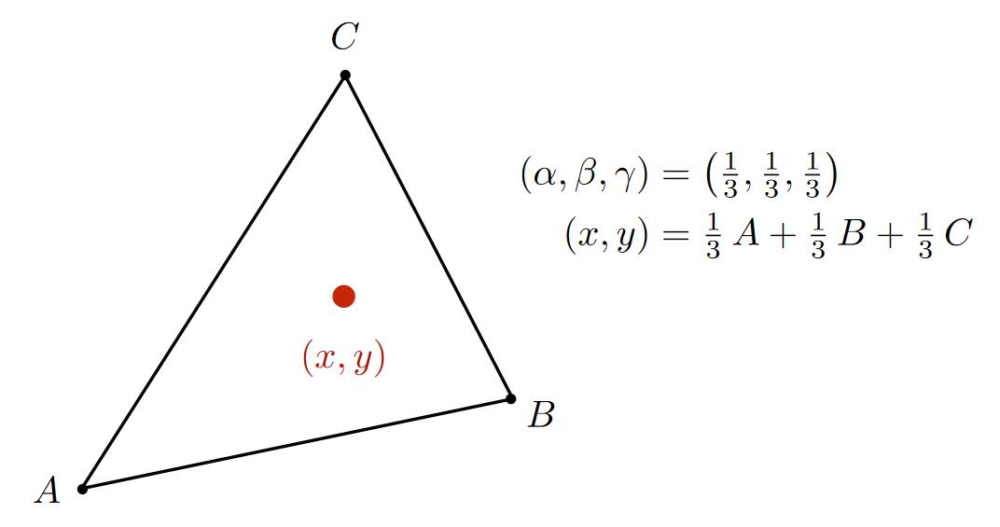
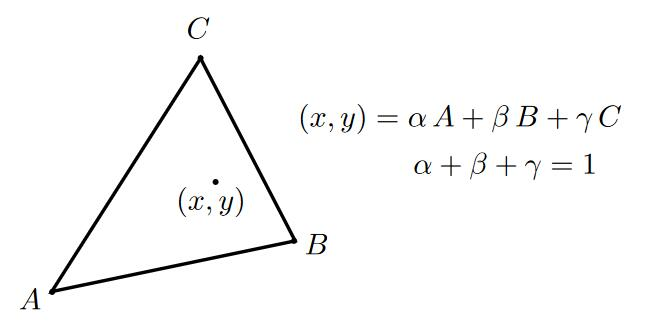

# Background

为什么需要计算三角形内插值？

答：很多特殊值的计算都是只计算顶点，而内部点的值通过插值得到平滑的结果。

插值可以用于哪些数据？

答：纹理坐标、颜色、法向量等

# 重心坐标 Barycentric Coordinates

**三角形的 \\(\left( \alpha , \beta , \gamma \right) \\) 坐标系统**

假设三角形的三个顶点分别是 A、B、C，则三角形所在平面上的任意一点可描述为A、B、C的线性组合，即：

\\[
\left( x,y \right) =\alpha A+\beta B+\gamma C
\\]

三角形内部的点需要满足：\\(\alpha +\beta +\gamma =1\\)   \\(\alpha \geqslant 0, \beta \geqslant 0,\gamma \geqslant 0\\)

\\(\left( \alpha , \beta , \gamma \right)\\) 称为三角形平面上的任意一点在三角形重心坐标系下的表示，简称为重心坐标。

在此定义下，可得出：

\\[
A=\left( 1,0,0 \right) \,\,  B=\left( 0,1,0 \right) \, C=\left( 0,0,1 \right)
\\]

\\[
重心 = \left( \frac{1}{3},\frac{1}{3},\frac{1}{3} \right)
\\]

以2D为例，任意点(x,y)的重心坐标公式：

解得：

\\[
\alpha =\frac{-\left( x-x_B \right) \left( y_C-y_B \right) +\left( y-y_B \right) \left( x_C-x_B \right)}{-\left( x_A-x_B \right) \left( y_C-y_B \right) +\left( y_A-y_B \right) \left( x_C-x_B \right)}
\\]

\\[
\beta =\frac{-\left( x-x_C \right) \left( y_A-y_C \right) +\left( y-y_C \right) \left( x_A-x_C \right)}{-\left( x_B-x_C \right) \left( y_A-y_C \right) +\left( y_B-y_C \right) \left( x_A-x_C \right)}
\\]

\\[
\gamma =1-\alpha -\beta
\\]

> **&#x1F4CC;** 重心坐标不是指某个点的坐标，而是根据三角形顶点定义的一套坐标系

# 利用重心坐标做插值

P是三角形内的一个点，根据P的坐标求出其重心坐标为\\(\left( \alpha , \beta , \gamma \right) \\)

\\(V_A, V_B, V_C\\)分别是三角形顶点上的属性值，

那么，P点处的属性值为：

\\[
V_P=\alpha V_A+\beta V_B+\gamma V_C
\\]

优点：计算方便

局限性：空间三角形在平面上投影以后，同一个点在投影前后的重心坐标会改变，因此，插值所有的重心坐标必须是投影前的重心坐标

------------------------------

> 本文出自CaterpillarStudyGroup，转载请注明出处。  
> https://caterpillarstudygroup.github.io/GAMES101_mdbook/