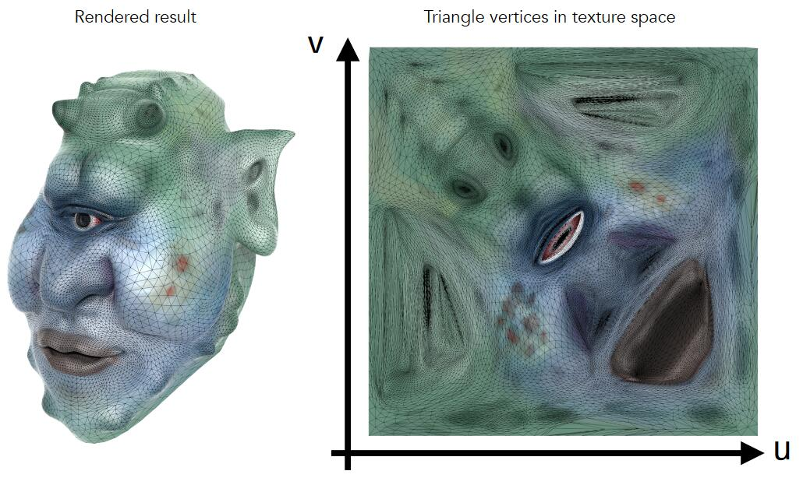

# 漫反射公式的拓展

  
[55：59]图上所有点处于相同的一光照环境下，因此共用同一个着色模型。这是Blinn-Phong模型中计算漫反射项的公式：

\\[
L_d=k_d\left( I/r^2 \right) \left( n\cdot l \right) 
\\]

但每个点上有不同的颜色，这些不同的颜色，对应公式中的\\(k_d\\)部分。\\(k_d\\)就是每个点的不同的属性。  

> &#x2705; \\(k_d\\)可以定义每个点的不同的属性。颜色纹理是其中一种属性。  

# 纹理映射 Texture Mapping

3D物体的表面是2D的。  

纹理：可以看作是一张有弹性、可拉伸的2D图。3D表面与2D图存在一一对应的关系。

纹理映射：是把2D纹理图贴在的物体表面的过程

映射关系：物体表面三角形面片上的顶点（3D坐标），与纹理图上的点（2D坐标）的对应关系。这个映射关系通常由美工生成或者由程序自动化生成。此处假设映射关系是已知的。  

> &#x2705; 如何自动生成纹理映射关系是其中一个研究方向。  

纹理坐标：纹理图上的点的坐标，用符号(u, v)表示，u和v的范围都是[0, 1]。不管纹理图实际上有多大，形状是否为正方形。  

> &#x2705; 如何生成可以首尾连接的纹理是其中一个研究方向

插值：映射关系只包含三角形顶点对应的(u，v)，三角形内部点的(u，v)通过插值得到

# 应用纹理

目的：为屏幕上的点p=(x,y)设置颜色

1. 找出p在投影前的坐标p'=(x,y,z)
2. 计算p'的(u,v)
3. 从texture中取出(u,v)点的值pv
4. 设置p的值为(u,v)点的值为pv

> &#x2753; pv值对应漫反射公式中的kd，那么漫反射公式的后面两项跟纹理有什么关系？

------------------------------

> 本文出自CaterpillarStudyGroup，转载请注明出处。  
> https://caterpillarstudygroup.github.io/GAMES101_mdbook/