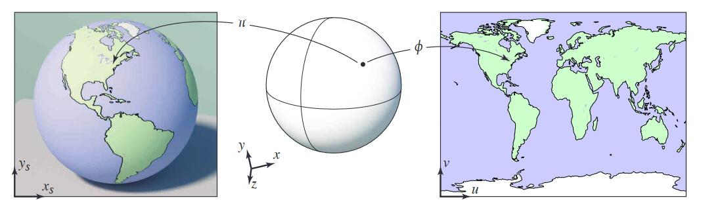
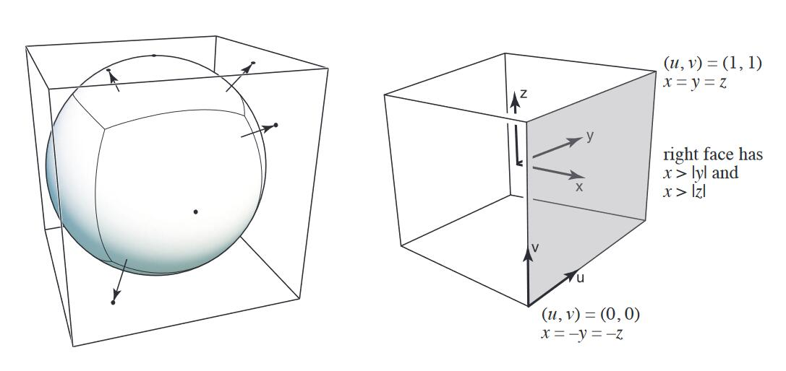

# 漫反射公式的拓展

[55：59]

\\[
L_d=k_d\left( I/r^2 \right) \left( n\cdot l \right) 
\\]

这是Blinn-Phong模型中计算漫反射项的公式。上述公式的特点是：  
- \\(k_d\\) 不同点的颜色不同 
- \\(\left( I/r^2 \right) \left( n\cdot l \right) \\) 小球上所有点处于相同的一光照环境下

由于这个公式可以描述不同颜色的点在同一光照环境下的不同表现。

这只是将公式应用于漫反射的一个例子，它也可以适用于物体表面的其它属性。例如用它来做纹理贴图，只需要把\\(k_d\\)换成一种可以表示纹理的属性。

# 纹理映射 Texture Mapping

3D物体的表面是2D的

纹理：可以看作是一张有弹性、可拉伸的2D图。

纹理映射：是把2D纹理图贴在的物体表面的过程

映射关系：物体表面三角形面片上的顶点，与纹理图上的点的对应关系。  

纹理坐标：纹理图上的点的坐标，用符号(u, v)表示，u和v的范围都是[0, 1]

插值：映射关系只包含三角形顶点对应的(u，v)，三角形内部点的(u，v)通过插值得到

# 应用纹理

目的：为屏幕上的点p=(x,y)设置颜色

1. 找出p在投影前的坐标p'=(x,y,z)
2. 计算p'的(u,v)
3. 从texture中取出(u,v)点的值pv
4. 设置p的值为(u,v)点的值为pv

> &#x2753; pv值对应漫反射公式中的kd，那么漫反射公式的后面两项跟纹理有什么关系？

# 纹理应用

纹理，原义为贴图。

广义上，纹理=内存 + 范围查询（滤图）

## 环境光照

以一个点出发，向其四周都能看到光，把这些光记录下来，就是环境光照

用这个环境光照来渲染茶壶

1. 用纹理描述环境光
2. 用环境光渲染其他物体
   
假设环境光的光源无限远，只记录方向信息，不记录深度信息，且在记录光照信息时，不区分光照的种类。

### 应用例子2 

[12:35] Spherical 环境图：

把环境光存储在球面上（左）

并把它展开：

但存在扭曲问题。

### Cube Map

把光照信息存在立方体表面，球表面点和立方体表面点可以一一对应。

并展开：

## 凹凸贴图

用纹理定义某个点的相对高度，在object triangle mesh不变的条件下，得到视觉上的表面凹凸效果，即：用复杂纹理代替复杂几何

原理：高度-->法线-->着色或法线-->着色

### 法线贴图 
Bump Mapping

2D：

切线方向 (1,dp)

法线方向 (-dp, 1)

3D:

切线方向 (1, dp/du, dp/dv)

法线方向 (-dp/du, -dp/dv, 1)

先在p点定义局部坐标系，假原始方向向上，为(0,1)或(0,0,1)

在此局部坐标系中求切线方向和法线方向，求导后再切回实际坐标系。

### 位移贴图

凹凸贴图的局限性：

1. 边缘处会露馅
2. 缺少“自己阴影投影到自己身上”
   
**位移贴图**：

输入：原始mesh，高度贴图

输出：mesh的顶点被改变

代价：要求原始mesh的三角形足够细

改进：动态三角形细分

## 3D纹理

纹理不只有表面，内部也有值，即空间任意一点都有值。

纹理并非实际定义，而是通过noise生成（右）

## 用纹理记录之前算好的信息

好处：很多计算可以提前算好

## 3D纹理用手体积渲染

用于记录3D空间信息

------------------------------

> 本文出自CaterpillarStudyGroup，转载请注明出处。
>
> https://caterpillarstudygroup.github.io/GAMES101_mdbook/