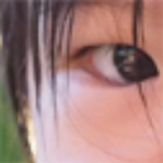

# 问题描述

Texture Map 是256X256的，而要投影的屏幕是4K的，会导致多个屏幕像素(pixel)对应一个纹理像素(texel)。

- 效果

- 原因

上图格子为纹理图，每个格子是一个texel。像素上某点映射到texel的红点位置。常规方法会取红点所在的texel的中心位置的value做为该像素的value。 
同理，所有映射到这个texel上任意位置的pixel，都会得到这个同样的Value。   

# 双线性插值 Bilinear Interpolation

## 原理

根据红点周围的点的value推断出红点处的value  

1. 计算出红点的位置(u,v)  
2. 取邻近四个纹理像素(a,b,c,d)  
3. 再根据(u,v)在a,b,c,d中的位置插值出(u,v)处的值，即分别做一个横向插值和竖向插值

## 具体步骤

Linear interpolation(1D)：

\\[lerp\left( x,v_0,v_1 \right) =v_0+x\left( v_1-v_0 \right) \\]

Two helper lerps:

\\[u_0=lerp\left( s,u_{00},u_{10} \right) \\]

\\[u_1=lerp\left( s,u_{01},u_{11} \right) \\]

Final vertical lerp, to get result:

\\[f\left( x,y \right) =lerp\left( t,u_0,u_1 \right) \\]

## 效果

虽然还有点模糊，但不是颗粒感的

# 双向三次插值 Bicubic

1. 取周围16个点
2. 三阶插值

效果：

------------------------------

> 本文出自CaterpillarStudyGroup，转载请注明出处。  
> https://caterpillarstudygroup.github.io/GAMES101_mdbook/