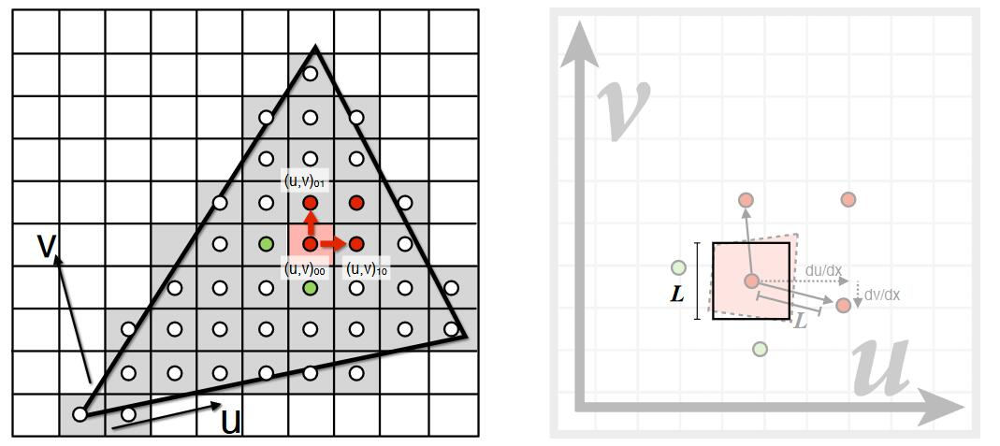

# 问题描述

Texture Map 是256X256的，而要投影的屏幕是4K的，会导致多个屏幕像素对应一个纹理像素。

效果：

# 双线性插值 Bilinear Interpolation

## 原理

1. 取对应格子的值
2. 取邻近四个纹理像素(a,b,c,d)再根据(u,v)在a,b,c,d中的位置插值出(u,v)处的值，即分别做一个横向插值和竖向插值

## 具体步骤

Linear interpolation(1D)：

\\[lerp\left( x,v_0,v_1 \right) =v_0+x\left( v_1-v_0 \right) \\]

Two helper lerps:

\\[u_0=lerp\left( s,u_{00},u_{10} \right) \\]

\\[u_1=lerp\left( s,u_{01},u_{11} \right) \\]

Final vertical lerp, to get result:

\\[f\left( x,y \right) =lerp\left( t,u_0,u_1 \right) \\]

# 效果

虽然还有点模糊，但不是颗粒感的

### 双向三次插值

Bicubic

1. 取周围16个点
2. 三阶插值

效果：

**问题描述2**：纹理像素分辨率过大

效果：（近处路齿，远多摩尔纹）

原因：[37:00]

由于透视的原因，不同距离的屏幕像素对应的纹理像素区域不同

> **&#x1F4CC;** 有的像素对应一小部分纹理像素，有的像素对应较大区域的纹理像素
> 
> 

一个屏幕像素对应一片纹理像素，但只取一个纹理像素来代表这一片点，就会出问题。

**解决方法：**

1. MSAA，超采样，可解决，但costly。
2. 点查询-->范围查询。不采样。而是取一个范围的平均值。

### Mip map 

[44:20]

目的：范围查询

特点：快，不精确（近似），方形区域

1. 根据原始纹理，预处理出低分辨率的纹理，仅消耗额外1/3存储。
   
   [47:17]
   
   

2. 找出屏幕上的一个像素对应的纹理上的近似方形区域。
   
   [52:30]
   
   

3. 根据mipmap计算边长为L的纹理方形区域的均值。边长为L的方形区域，会在第\\(\log _2L\\)层变成一个像素。直接查在\\(\log _2L\\)层纹理上查(u,v)的值即可。

4. 效果：
   
   [56：20]
   
   

   不同颜色代表查询不同的层，但是，存在两层之间的边界，边界处可能存在突变

5. 改进：利用三线性插值得出例如1.8层的值，即层数也可以是连续的值。
   
   [57:52]
   
   把D层的插鱼结果与D + 1层的结果再做一次插值

6. 效果：
   
   [1：00：20]
   
   
   
   MipMap解决问题描述2的效果：
   
   

   远处变成一片灰色

   原因：mipmap只能计算方形区域

7. 改进：三线性插值-->各项异性过滤(Anisotropic littering)
   
   对原始纹理做不均匀压缩，这样，有形压缩区域对应原始的矩形区域。[103：35]
   
   
   
   屏幕的方形区域实际上是对应纹理空间的不规律形状，如果用正方形来代表这长条，会发生过渡blur。 [1：04：40]
   
   各项异性过滤能解决水平或竖直长方形的问题，不能解决倾斜长方形的问题。

8. 改进：Anisotropic Filting --> EWA Filtering
   [1:06:31] 
   
   
