# 问题描述

## 现象

纹理像素分辨率过大，比被贴图的表面更精细，也会出现问题。例如：

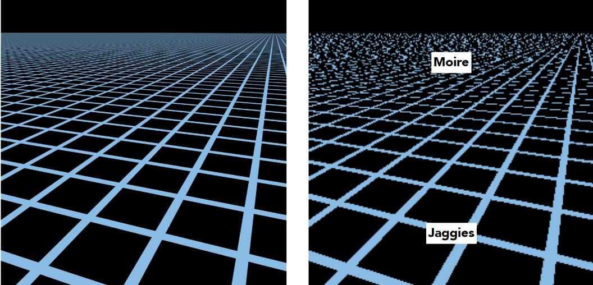   

> &#x1F446; 左：期待效果 右：实际效果

## 原因

由于透视的原因，不同距离的屏幕像素对应的纹理像素区域不同

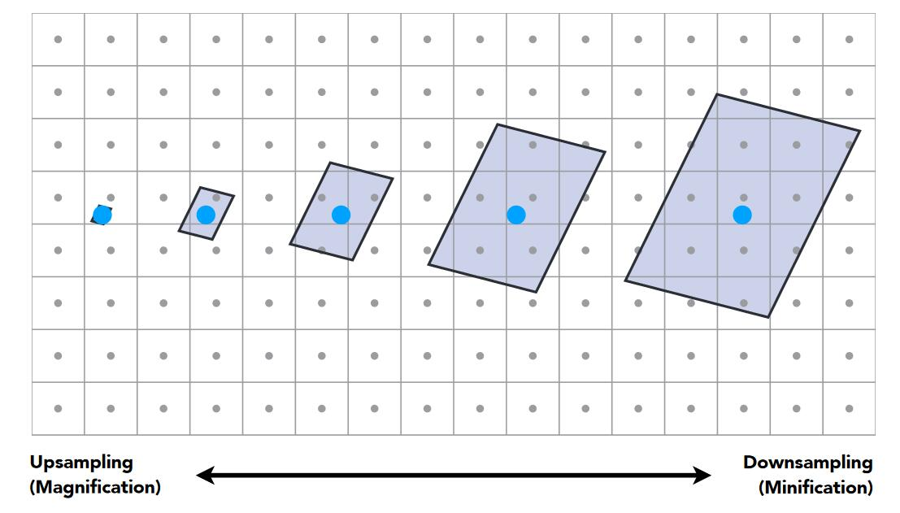  
> **&#x1F446;** 有的像素对应一小部分纹理像素，有的像素对应较大区域的纹理像素

- 在近处，物体表面比纹理图更精细，即Texture Magnification问题，见上一页，表现为锯齿。  

> &#x1F50E;[Texture Magnification](TextureMagnification.md)

- 在远处，纹理图比物体表面精细，一个屏幕像素对应一片纹理像素，但只取一个纹理像素来代表这一片点，也会出现问题，表现为摩尔纹

进一步解释，从纹理图中取一个texel的过程可以看作是对纹理图的采样。alias的本质是信号变化过快而采样跟不上信号变化的速度。纹理的变化快而采样点稀疏就导致了这种现象。  

> &#x1F4A1; 两个空间的映射，任何一方的不匹配都会现alias，那就对变化快的一块做平均，或对变化慢的一方做细分。  

# 解决方法一：超采样 MSAA

> &#x1F50E;[MSAA](../Rasterization/AntialiasingMore.md)

- 原理

对于远处的一个点，取512个texel的value的平均值。  

- 效果
  
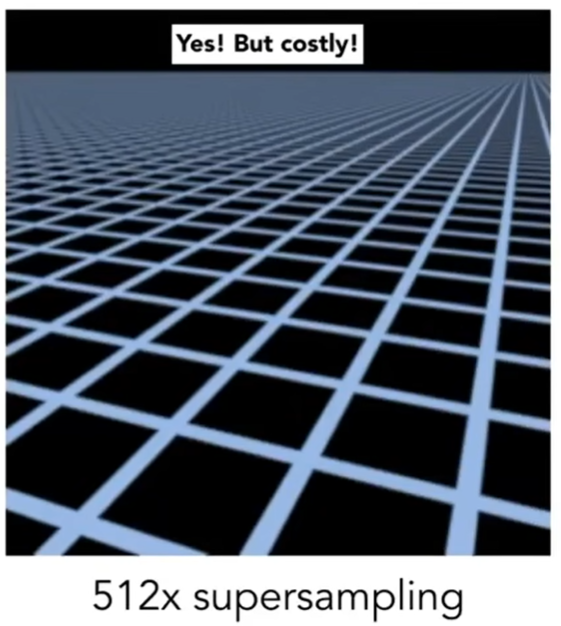

- 局限性
  
可解决，但costly。

# 解决方法二： Mip map[44:20]

## 原理  

点查询（采样）-->范围查询（取一个范围的平均）。  

> &#x1F4CC;  
范围查询的应用场景非常广泛，除了CG，还有其它很多领域会用到。  
范围查询的目标也有多种，例如取范围内的最大值、最小值、平均值。在这里要查的是平均值。  
范围查询的算法也有很多种，在当前场景下使用同MIP Map算法来做范围平均值的查询。  

## Mip Map算法

- 作用：用于范围内平均值的查询
- 特点：快，不精确（近似），只能查询正方形区域

1. 原始纹理称为第0层纹理，根据第0层纹理预先生成出第1-7层纹理。每一层都是上一层缩小一倍。1-7层低分辨率纹理总共仅消耗额外1/3存储。
   
   [47:17]
   
   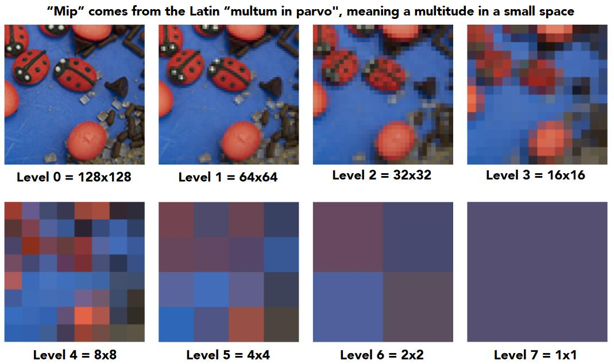

2. 找出屏幕上的一个像素对应的纹理上的近似方形区域。
   
   [52:30]
    
   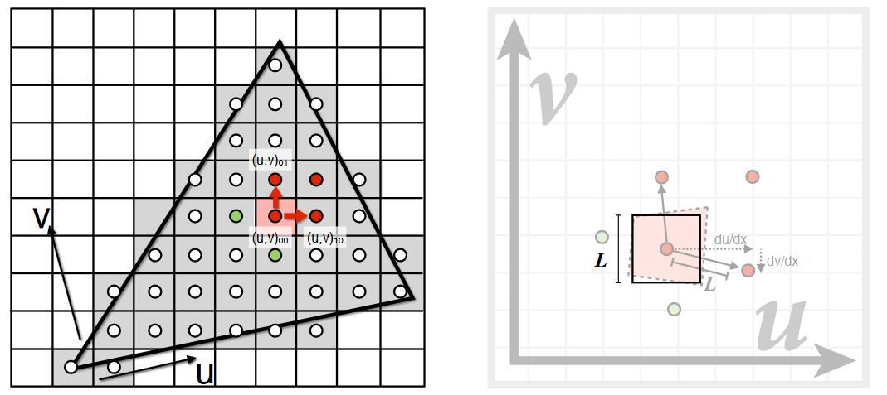

**第一步：画出像素对应的四边形区域**

已知某像素及其邻居像素对应的texel的位置。像素与上面邻居像素对应的texel位置的中线，认为是像素对应的texel的上边界。  
以这种方法，可以在纹理上画出一个不规则四边形区域。  

   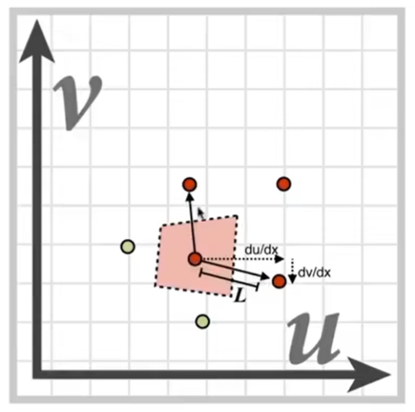

**第二步：用一个正方形来近似这个不规则四边形区域。**   

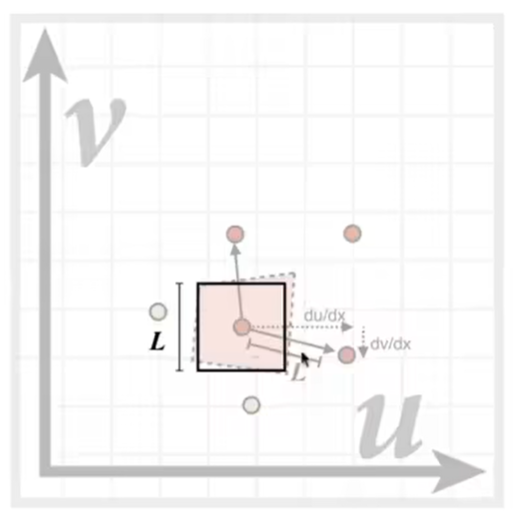

边长L为：  

$$
L = \max(\sqrt{(\frac{du}{dx})^2+(\frac{dv}{dx})^2}, \sqrt{(\frac{du}{dy})^2+(\frac{dv}{dy})^2})
$$

> &#x2753; 问：这个公式没有看懂。x和y分别是指什么呢？公式里的变化量是什么呢？是什么和什么之间取最大值？  
> &#x2705; 答：x和y分别是两个邻居。L是当前texel与两个邻居之间的距离的最大值。（为什么是两个？为什么是这两个邻居？）公式中的两项，分别代表当前texel和x、y的距离。距离是用勾股定理算出来的。里面的微分量是当前texel到邻居的位置变化，分别对应横轴的变化和纵轴的变化。  
> 这只是一种近似方法。可以用其它达到近似目的的方法。

3. 根据mipmap计算边长为L的纹理方形区域的均值。边长为L的方形区域，会在第\\(\log_2L\\)层变成一个像素。直接查在\\(\log_2L\\)层纹理上查(u,v)的值即可。

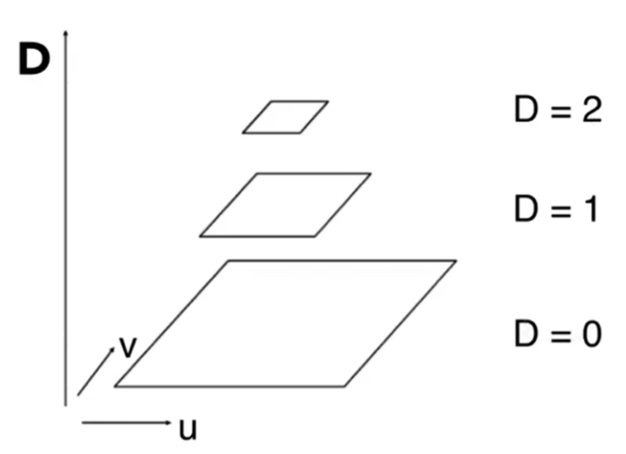

## 效果
   
   [56：20]
   
   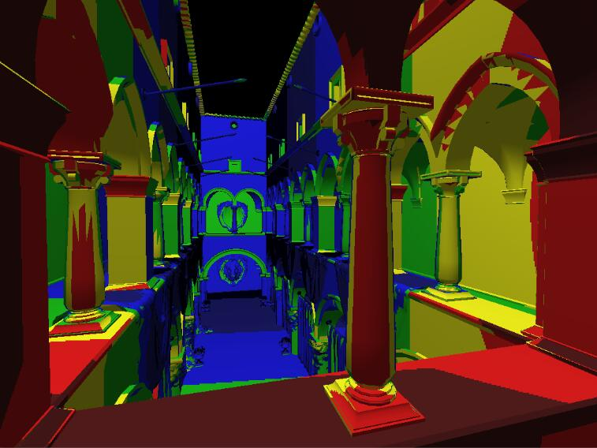
> &#x1F446; 不同颜色代表查询不同的层。  

整体上颜色变化反应了需要的纹理大小。但是，存在两层之间的边界，边界处可能存在突变。  

> &#x1F4A1; 提前算好部分范围的值，结果是不同范围的组合。  
> 空间换时间，要想换得好，就要能分解出可以提前计算的部分，且这部分满足：  
> 1. 是计算的瓶颈  
> 2. 不依赖输入  
> 3. 分解与组合方便

# 改进：三线性插值

## 原理

这是一种基于mip map的改进，把层数变成一个连续的值，能够解决层数边界上的突变

方法：根据层数再做一次插值，例如需要计算第1.8层的值，就把第1层的插值结果与第2层的插值结果再做一次插值 [57:52]

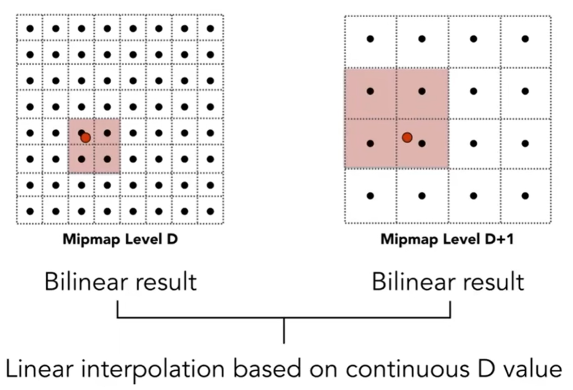

## 效果
   
   [1：00：20]
   
   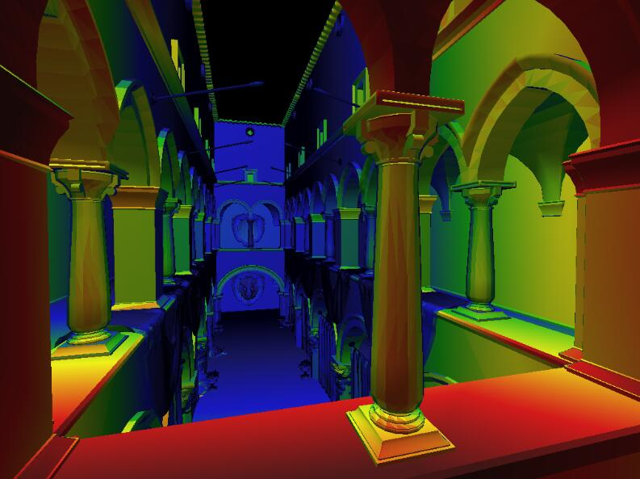
> &#x1F446; 不同颜色代表查询不同的层。层与层之间存在渐变的过渡。  

> &#x1F4A1; 层数很明显是离散信息，连续的层数没有意义，但可以用来插值。总之，万物皆可插。  
   
回到原来那个问题，假设把512超采样的结果看作是这个问题的GT，对比三线性插值后的效果：  

|512超采样|三线性插值|
|---|---|
|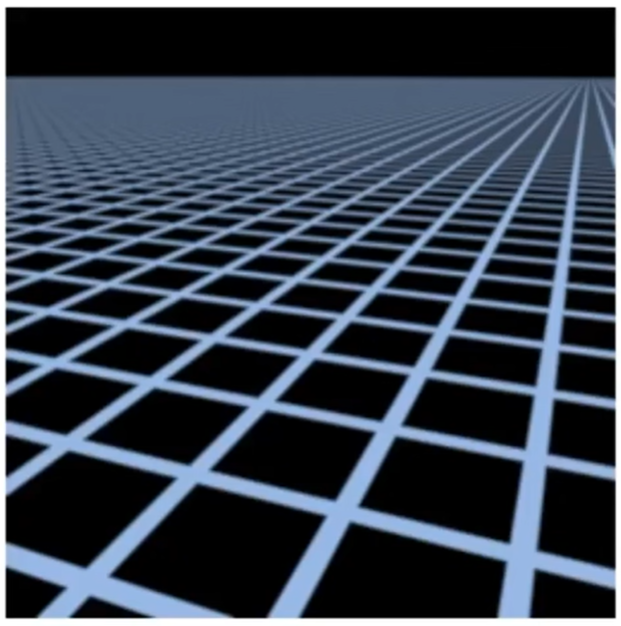|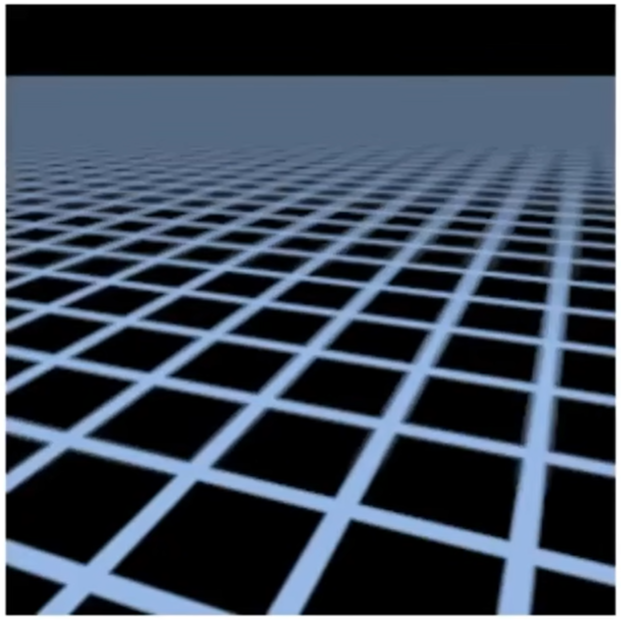|

远处没有摩尔纹，但是变成了一片灰色，这种情况称为overblur。  
这是因为mipmap只能计算方形区域。而根据上图可以看出，屏幕的方形区域不对应纹理图上的方形区域。

# 改进：Ripmap：各项异性过滤(Anisotropic littering)
   
## 原理

MipMap只预计算图中对角线上的图片，它假设纹理是按同比例压缩的。但事实上不是这样。  

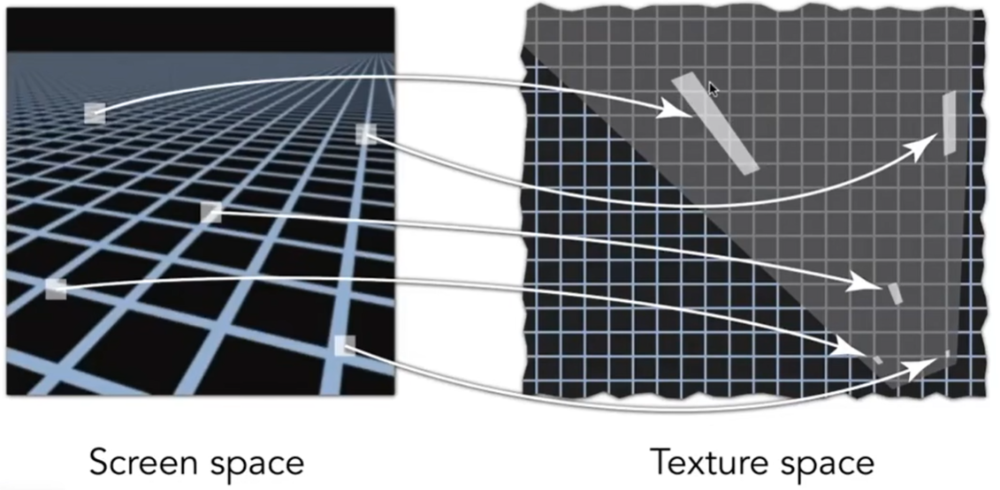
> &#x1F446; 屏幕的方形区域实际上是对应纹理空间的不规律形状，如果用正方形来代表这长条，会发生过渡blur。 [1：04：40]

> &#x1F4A1; 如果我来解这个问题，我会把一个倾斜成多个大小不同的正方式。再以正方形的大小为权重对正方形结果求平均。  

各项异性过滤对原始纹理做不均匀压缩，这样，就可以查询到在纹理上一块长形区域，或宽形区域的值。[103：35]
   
   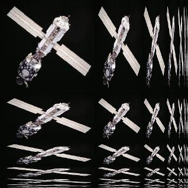
   
   各项异性过滤能解决水平或竖直长方形的问题，不能解决倾斜长方形的问题。

存储开销增加了3倍。  

# 改进：EWA Filtering
   [1:06:31] 
   
   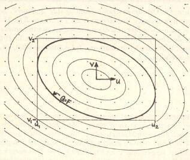

1. 把不规则形状拆成很多不同的**圆形**去覆盖这个不规则形状。  
2. 每次查询一个圆形区域，进行多次查询。

> &#x2753; 为什么是圆形？

特点：质量越好，代价越大

------------------------------

> 本文出自CaterpillarStudyGroup，转载请注明出处。  
> https://caterpillarstudygroup.github.io/GAMES101_mdbook/