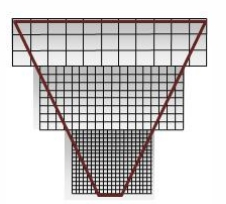

## Big World and Cascade Shadow

- Partition the frustum into multiple frustums   
- A shadow map is rendered for each sub frustum   
- The pixel shader then samples from the map that most closely matches the required resolution    

   

> 不同远近的物体的 shadow，对精度的要求是不一样的。这样，近处 shadow 足够清晰，远处 shadow 足够稀疏。     

P73   
## Blend between Cascade Layers

1. A visible seam can be seen where cascades overlap    
2. between cascade layers because the resolution does not match    
3. The shader then linearly interpolates between the two values based on the pixel's location in the blend band    

P74    
## Pros and Cons of Cascade Shadow

- Pros
  - best way to prevalent errors with shadowing: perspective aliasing    
  - fast to generate depth map, 3x up when depth writing only   
  - provide fairly good results   
- Cons   
  - Nearly impossible to generate high quality area shadows   
  - No colored shadows. Translucent surfaces cast opaque shadows   

--------------------------------

> 本文出自CaterpillarStudyGroup，转载请注明出处。  
> https://caterpillarstudygroup.github.io/GAMES101_mdbook/
