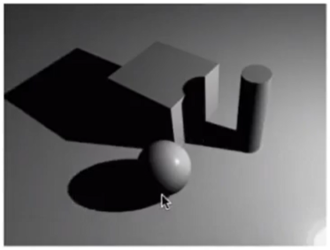
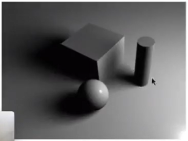
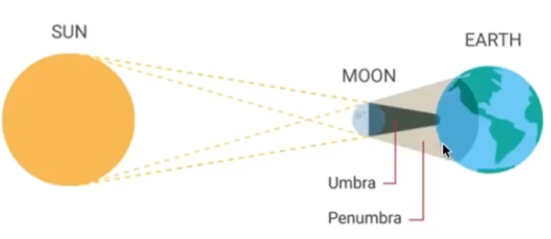

 
# 硬阴影 Vs 软阴影

|硬阴影[1：11：40]|软阴影[1：12：09]|
|---|---|
|||
|边缘锐利|边缘慢慢过渡|

软阴影的形成原因：半影[1：13：31]，光源较大，部分光源被挡住

> &#x2705; 从面光源的不同位置看向物理，得到的z-buffer是不同的。第一步只能记录一个点相关的z-buffer，因此无法处理面光源。  

--------------------

> 本文出自CaterpillarStudyGroup，转载请注明出处。  
> https://caterpillarstudygroup.github.io/GAMES101_mdbook/