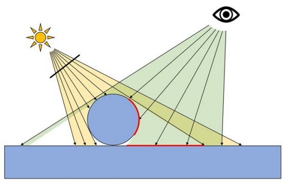
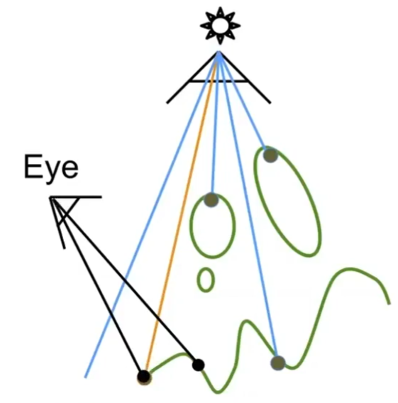
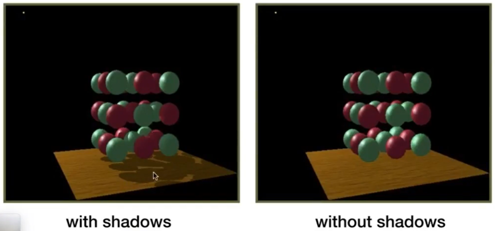
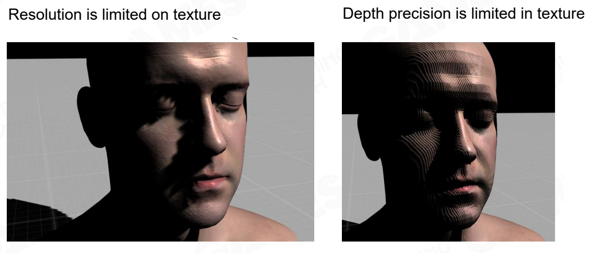

# Shadow Mapping 算法

Shadow Mapping是一种基于光栅化的生成阴影的经典算法。

### 原理

如果一个点不在阴影里，那么必须同时满足：
- 人（camera）可以看见点
- 光源可以看见点

### 具体步骤：

1. 从光源看向场景[55：13]，记录能看到的点的深度(shadow map)。

   

> &#x2705; 找到满足“光源可以看见”的点  

2. 从眼睛看向场景[56：41]，记录眼睛能看到的点。
> &#x2705; 找到满足“相机可以看见”的点  

3. 把眼睛能看到的点投影回step1记录的深度图上，即推出它会出现在深度图的哪个像素上
> &#x2705; 计算点在“光源视角”和“相机视角”的对应关系  
  
4. 如果点到光源的深度与叫step1记录的这个方向的深度一致，
则：这个点可被光源和 camera 同时看到，不在阴影中。否则：在阴影中
> &#x2705; 分析点是否满足“阴影条件”

|不在阴影中|在阴影中|
|---|---|
|||

### 效果

光源是左上角的白点  

### 特点

Shadow Mapping算法具有以下特点：
- 在生成阴影的这一步，不需要知道场景的几何信息
- 走样现象
- 该算法只能处理点光源

> &#x2753; 为什么说不需要知道场景的几何信息呢？第一步和第二步都用到场景的几何信息了啊。  
> &#x2705; 点光源产生硬阴影，面光源产生软阴影。

### 存在点的问题

1. step 4判断距离是否相等，但距离是浮点数，浮点数有精度问题
2. 深度图的采样频率和渲染的采样频率一致，会引发 artifacts.
3. 增加一遍渲染

> &#x2753; 怎么理解增加一遍渲染，不能同时渲染吗？  

4. 只能做硬阴影（点光源）

  

------------------------------

> 本文出自CaterpillarStudyGroup，转载请注明出处。  
> https://caterpillarstudygroup.github.io/GAMES101_mdbook/